# NeuraForge OS Project Analysis Design

## Overview

This design document outlines a systematic approach to analyzing the NeuraForge OS project, identifying issues across multiple dimensions (structure, code quality, runtime, performance, security), and implementing a prioritized resolution strategy. The analysis will be comprehensive yet efficient, focusing on actionable insights that improve project health and maintainability.

## Architecture

### Analysis Pipeline

The analysis follows a multi-stage pipeline approach:

1. **Discovery Phase**: Scan project structure and gather metadata
2. **Static Analysis Phase**: Analyze code without execution
3. **Runtime Analysis Phase**: Test functionality with running services
4. **Assessment Phase**: Categorize and prioritize findings
5. **Resolution Phase**: Systematically fix issues
6. **Verification Phase**: Validate fixes and ensure no regressions

### Analysis Dimensions

```mermaid
graph TD
    A[Project Analysis] --> B[Structure Analysis]
    A --> C[Code Quality Analysis]
    A --> D[Runtime Testing]
    A --> E[Performance Analysis]
    A --> F[Security Assessment]
    
    B --> B1[Directory Structure]
    B --> B2[Configuration Files]
    B --> B3[Dependency Management]
    
    C --> C1[Syntax Validation]
    C --> C2[Type Checking]
    C --> C3[Linting Rules]
    C --> C4[Dead Code Detection]
    
    D --> D1[Service Startup]
    D --> D2[API Testing]
    D --> D3[WebSocket Testing]
    D --> D4[Authentication Flow]
    
    E --> E1[Bundle Analysis]
    E --> E2[Load Testing]
    E --> E3[Memory Usage]
    
    F --> F1[Vulnerability Scan]
    F --> F2[Secret Detection]
    F --> F3[Access Control]
```



## Components and Interfaces

### 1. Project Scanner Component

**Purpose**: Discover and catalog all project files and configurations

**Interface**:
```typescript
interface ProjectScanner {
  scanDirectory(path: string): ProjectStructure
  identifyConfigurations(): ConfigurationMap
  analyzeDependencies(): DependencyGraph
}
```

**Implementation Strategy**:
- Recursively traverse directory structure
- Identify package.json, tsconfig.json, and other config files
- Build dependency graph across monorepo packages
- Detect duplicate or conflicting configurations

### 2. Static Code Analyzer Component

**Purpose**: Analyze code quality without execution

**Interface**:
```typescript
interface StaticAnalyzer {
  checkSyntax(files: string[]): SyntaxIssue[]
  validateTypes(): TypeIssue[]
  runLinting(): LintIssue[]
  detectDeadCode(): DeadCodeIssue[]
}
```

**Implementation Strategy**:
- Use TypeScript compiler API for syntax and type checking
- Integrate ESLint for code style validation
- Implement custom rules for dead code detection
- Analyze import/export usage patterns

### 3. Runtime Tester Component

**Purpose**: Test application functionality with running services

**Interface**:
```typescript
interface RuntimeTester {
  startServices(): ServiceStatus[]
  testEndpoints(endpoints: Endpoint[]): EndpointResult[]
  validateWebSockets(): WebSocketResult[]
  testAuthentication(): AuthResult[]
}
```

**Implementation Strategy**:
- Use process management to start/stop services
- HTTP client for API endpoint testing
- WebSocket client for real-time feature testing
- Automated authentication flow testing

### 4. Performance Analyzer Component

**Purpose**: Identify performance bottlenecks and optimization opportunities

**Interface**:
```typescript
interface PerformanceAnalyzer {
  analyzeBundles(): BundleAnalysis
  measureLoadTimes(): LoadTimeMetrics
  checkMemoryUsage(): MemoryMetrics
  identifyBottlenecks(): PerformanceIssue[]
}
```

**Implementation Strategy**:
- Bundle analyzer integration for size analysis
- Lighthouse integration for web performance
- Memory profiling during runtime testing
- Network request analysis

### 5. Security Auditor Component

**Purpose**: Identify security vulnerabilities and compliance issues

**Interface**:
```typescript
interface SecurityAuditor {
  scanVulnerabilities(): VulnerabilityReport
  detectSecrets(): SecretIssue[]
  validateAccessControl(): AccessControlIssue[]
  checkCompliance(): ComplianceReport
}
```

**Implementation Strategy**:
- npm audit integration for dependency vulnerabilities
- Pattern matching for secret detection
- Authentication/authorization flow analysis
- OWASP compliance checking

### 6. Issue Manager Component

**Purpose**: Categorize, prioritize, and track issue resolution

**Interface**:
```typescript
interface IssueManager {
  categorizeIssues(issues: Issue[]): CategorizedIssues
  prioritizeIssues(issues: Issue[]): PrioritizedIssues
  trackResolution(issue: Issue): ResolutionStatus
  generateReport(): AnalysisReport
}
```

**Implementation Strategy**:
- Rule-based categorization system
- Priority scoring algorithm based on impact and effort
- Task tracking integration
- Comprehensive reporting with metrics

## Data Models

### Issue Classification

```typescript
interface Issue {
  id: string
  type: IssueType
  severity: Severity
  category: Category
  description: string
  location: Location
  estimatedEffort: EffortLevel
  dependencies: string[]
  resolution?: Resolution
}

enum IssueType {
  CRITICAL_ERROR = 'critical_error',
  PERFORMANCE = 'performance',
  CODE_QUALITY = 'code_quality',
  SECURITY = 'security',
  ACCESSIBILITY = 'accessibility',
  DOCUMENTATION = 'documentation'
}

enum Severity {
  HIGH = 'high',
  MEDIUM = 'medium',
  LOW = 'low'
}

enum Category {
  BLOCKING = 'blocking',
  OPTIMIZATION = 'optimization',
  MAINTENANCE = 'maintenance',
  ENHANCEMENT = 'enhancement'
}
```

### Analysis Results

```typescript
interface AnalysisReport {
  summary: AnalysisSummary
  structureAnalysis: StructureAnalysis
  codeQualityAnalysis: CodeQualityAnalysis
  runtimeAnalysis: RuntimeAnalysis
  performanceAnalysis: PerformanceAnalysis
  securityAnalysis: SecurityAnalysis
  issues: CategorizedIssues
  recommendations: Recommendation[]
}

interface AnalysisSummary {
  totalIssues: number
  criticalIssues: number
  performanceIssues: number
  securityIssues: number
  overallHealth: HealthScore
  estimatedResolutionTime: Duration
}
```

## Error Handling

### Analysis Error Recovery

1. **File Access Errors**: Continue analysis with available files, log missing files
2. **Compilation Errors**: Capture and categorize as critical issues
3. **Runtime Errors**: Attempt graceful degradation, capture error details
4. **Network Errors**: Retry with exponential backoff, mark services as unavailable
5. **Memory Errors**: Implement streaming analysis for large codebases

### Issue Resolution Error Handling

1. **Fix Application Failures**: Rollback changes, mark issue as requiring manual intervention
2. **Test Failures**: Re-run tests, capture failure details for investigation
3. **Dependency Conflicts**: Provide multiple resolution strategies
4. **Build Failures**: Capture build logs, suggest incremental fixes

## Testing Strategy

### Analysis Validation

1. **Unit Tests**: Test individual analyzer components with mock data
2. **Integration Tests**: Test analyzer pipeline with sample projects
3. **Regression Tests**: Ensure fixes don't introduce new issues
4. **Performance Tests**: Validate analysis completes within reasonable time

### Resolution Validation

1. **Automated Testing**: Run full test suite after each fix
2. **Smoke Testing**: Verify basic functionality after critical fixes
3. **Cross-browser Testing**: Ensure frontend fixes work across browsers
4. **Load Testing**: Verify performance improvements under load

### Quality Gates

1. **Pre-Resolution**: All critical issues must be identified and categorized
2. **Post-Fix**: Each fix must pass automated tests
3. **Final Validation**: Complete system must pass all functional tests
4. **Performance Baseline**: System must meet or exceed performance targets

## Implementation Phases

### Phase 1: Foundation (Discovery & Static Analysis)
- Implement project scanner and structure analysis
- Set up static code analysis pipeline
- Create issue categorization system
- Generate initial findings report

### Phase 2: Runtime Analysis
- Implement service management and testing
- Add API endpoint validation
- Test WebSocket functionality
- Validate authentication flows

### Phase 3: Performance & Security
- Add bundle analysis and performance metrics
- Implement security vulnerability scanning
- Create accessibility validation
- Generate comprehensive assessment

### Phase 4: Resolution Engine
- Implement automated fix application
- Add resolution tracking and validation
- Create rollback mechanisms
- Build final reporting system

### Phase 5: Validation & Optimization
- Comprehensive testing of all fixes
- Performance optimization validation
- Security compliance verification
- Final production readiness assessment

## Success Metrics

1. **Issue Detection Rate**: >95% of known issues identified
2. **False Positive Rate**: <5% of reported issues are false positives
3. **Resolution Success Rate**: >90% of automated fixes successful
4. **Analysis Performance**: Complete analysis in <10 minutes
5. **System Health Improvement**: Measurable improvement in all health metrics