# NeuraForge Feature Specifications

## **Executive Summary**

This document provides comprehensive specifications for all NeuraForge features, organized by priority tier and aligned with our $2M seed funding timeline. Features are categorized as MVP (Months 1-12), Post-MVP (Months 12-24), and Future (Months 24+) based on user research and business objectives.

**Current Status**: 35% MVP completion with proven Next.js 14/TypeScript architecture  
**Target**: 2,500 active researchers by Year 1, 25,000 by Year 3  
**Success Criteria**: 40% reduction in research time-to-discovery, 300% increase in collaboration

---

## **VISUAL WORKFLOW ARCHITECTURE**

### **Complete UI Component Mapping**

#### **Header Navigation System**

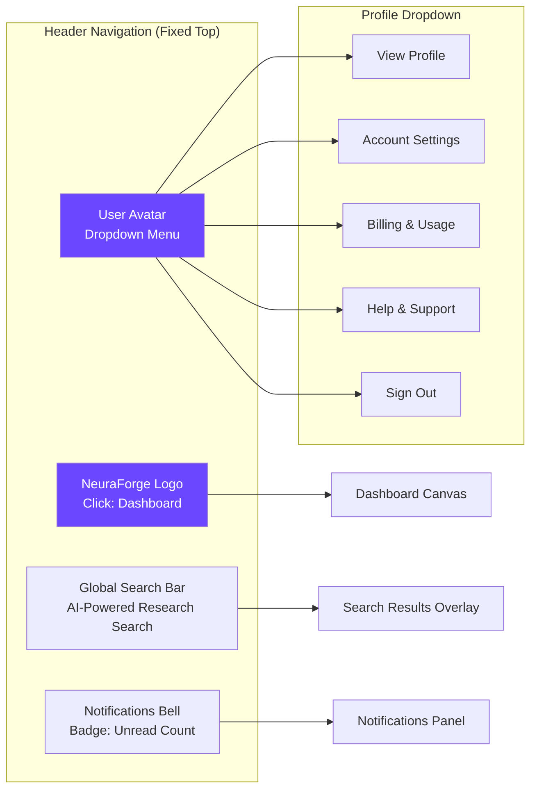

#### **Left Sidebar Navigation System**

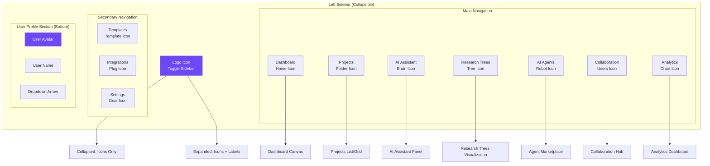

#### **Right Sidebar Tool System**

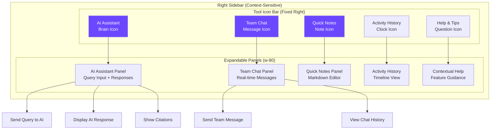

#### **Dashboard Canvas Layout**

```mermaid
graph TB
    subgraph "Main Dashboard Canvas"
        subgraph "Welcome Section"
            WELCOME_HEADER[Welcome Back, Dr. [Name]]
            QUICK_ACTIONS[Quick Action Buttons]
            RECENT_ACTIVITY[Recent Activity Feed]
        end

        subgraph "Project Overview Grid"
            ACTIVE_PROJECTS[Active Projects<br/>Card Grid Layout]
            PROJECT_STATS[Project Statistics<br/>Charts & Metrics]
            TEAM_ACTIVITY[Team Activity<br/>Collaboration Updates]
        end

        subgraph "AI Insights Section"
            AI_RECOMMENDATIONS[AI Recommendations<br/>Suggested Actions]
            RESEARCH_TRENDS[Research Trends<br/>Domain Insights]
            LITERATURE_UPDATES[Literature Updates<br/>New Papers]
        end

        subgraph "Quick Access Tools"
            NEW_PROJECT_BTN[+ New Project<br/>Large CTA Button]
            INVITE_TEAM_BTN[Invite Team Members]
            BROWSE_AGENTS_BTN[Browse AI Agents]
        end
    end

    NEW_PROJECT_BTN --> PROJECT_CREATION[Project Creation Modal]
    INVITE_TEAM_BTN --> INVITE_MODAL[Team Invitation Modal]
    BROWSE_AGENTS_BTN --> AGENT_MARKETPLACE[Agent Marketplace View]

    style NEW_PROJECT_BTN fill:#6B48FF,color:#fff
    style WELCOME_HEADER fill:#f8f9fa
```

### **Feature Interconnection Flow Diagrams**

#### **Complete User Authentication to Dashboard Flow**

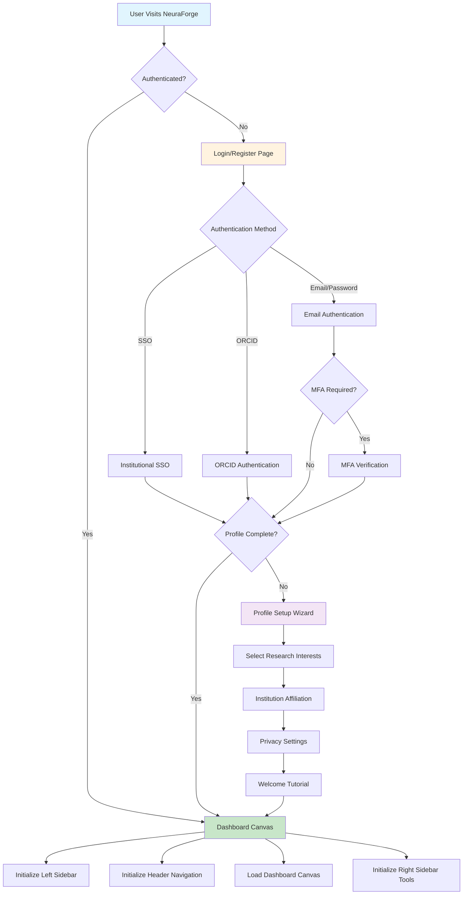

---

## **MVP FEATURES (Months 1-12) - Priority Tier 1**

### **F1.1 User Authentication & Profile Management**
**Status**: ✅ IMPLEMENTED (Clerk Integration)

**Core Requirements:**
- Multi-factor authentication with enterprise SSO support
- Researcher verification and institutional affiliation
- Profile customization with research interests and expertise
- Privacy controls for profile visibility and data sharing

**Technical Specifications:**
- Clerk authentication with custom user metadata
- PostgreSQL user profiles with encrypted sensitive data
- RBAC (Role-Based Access Control) implementation
- OAuth 2.0 and SAML 2.0 support for enterprise customers

**Acceptance Criteria:**
- [x] User can register with email/password or SSO in <30 seconds
- [x] Profile verification process completes within 24 hours
- [x] Privacy settings allow granular control over data visibility
- [x] Enterprise customers can enforce SSO-only authentication

### **F1.2 AI Research Assistant**
**Status**: 🔄 IN DEVELOPMENT (Q1 2025)

**Core Requirements:**
- Literature summarization and gap analysis
- Hypothesis generation from research context
- Experimental design suggestions and optimization
- Real-time research assistance during writing and analysis

**Technical Specifications:**
```typescript
interface AIAssistant {
  capabilities: ResearchCapability[]
  contextWindow: number // 32k tokens minimum
  responseTime: number // <3 seconds for 95th percentile
  confidenceScoring: boolean
  citationTracking: boolean
}

enum ResearchCapability {
  LITERATURE_REVIEW = "literature_review",
  HYPOTHESIS_GENERATION = "hypothesis_generation", 
  EXPERIMENTAL_DESIGN = "experimental_design",
  DATA_ANALYSIS = "data_analysis",
  WRITING_ASSISTANCE = "writing_assistance"
}
```

**Integration Points:**
- OpenAI GPT-4 API with custom fine-tuning
- arXiv, PubMed, and Google Scholar API integration
- Real-time collaboration system for shared AI interactions
- Usage tracking and billing integration

**Acceptance Criteria:**
- [ ] AI generates literature summaries in <10 seconds
- [ ] Hypothesis suggestions have >70% researcher approval rate
- [ ] Experimental design recommendations reduce setup time by 30%
- [ ] Citation accuracy >95% with proper attribution

### **F1.3 Project Management System**
**Status**: 🔄 IN DEVELOPMENT (Q1 2025)

**Core Requirements:**
- Research project creation with templates and workflows
- Milestone tracking with progress visualization
- Team member invitation and role management
- Integration with institutional systems and funding databases

**Technical Specifications:**
- PostgreSQL project schema with hierarchical organization
- Real-time progress tracking with WebSocket updates
- File storage integration (AWS S3 compatible)
- Notification system for project updates and deadlines

**User Interface Requirements:**
- Kanban board view for project phases
- Gantt chart visualization for timeline management
- Dashboard widgets for project overview and metrics
- Mobile-responsive design for on-the-go access

**Acceptance Criteria:**
- [ ] Project creation takes <5 minutes with template
- [ ] Team members receive invitations within 1 minute
- [ ] Progress updates sync in real-time across all devices
- [ ] Integration with 5+ major institutional systems

### **F1.4 Real-Time Collaborative Workspaces**
**Status**: ⏳ PLANNED (Q1 2025)

**Core Requirements:**
- Shared document editing with conflict resolution
- Live chat and video integration during collaboration
- Whiteboard and diagramming tools for visual collaboration
- Version control with branching and merging capabilities

**Technical Specifications:**
```typescript
interface CollaborativeWorkspace {
  documentEngine: OperationalTransform
  videoIntegration: WebRTCConnection
  whiteboardEngine: CanvasAPI
  versionControl: GitLikeSystem
  maxConcurrentUsers: 50
  latencyTarget: 50 // milliseconds
}
```

**Performance Requirements:**
- <50ms latency for collaborative editing
- Support for 50+ concurrent users per workspace
- 99.9% uptime with automatic failover
- Real-time sync across desktop and mobile devices

**Acceptance Criteria:**
- [ ] Multiple users can edit simultaneously without conflicts
- [ ] Video calls integrate seamlessly within workspace
- [ ] Whiteboard supports complex scientific diagrams
- [ ] Version history preserves all changes with attribution

### **F1.5 Research Trees (Basic)**
**Status**: ⏳ PLANNED (Q2 2025)

**Core Requirements:**
- Version-controlled research workflows with branching
- Dependency tracking between research components
- Visual representation of research progression
- Merge capabilities for collaborative research paths

**Technical Specifications:**
- Git-like version control adapted for research artifacts
- Graph database (Neo4j) for relationship mapping
- Visual rendering engine for tree visualization
- Semantic diff algorithms for research content

**Data Model:**
```typescript
interface ResearchNode {
  id: string
  type: 'hypothesis' | 'experiment' | 'analysis' | 'conclusion'
  content: ResearchArtifact
  dependencies: string[]
  branches: ResearchBranch[]
  metadata: NodeMetadata
}
```

**Acceptance Criteria:**
- [ ] Users can create research branches in <30 seconds
- [ ] Visual tree updates in real-time as research progresses
- [ ] Merge conflicts are detected and highlighted for resolution
- [ ] Research lineage is preserved with full audit trail

---

## **POST-MVP FEATURES (Months 12-24) - Priority Tier 2**

### **F2.1 AI Agent Marketplace**
**Status**: ⏳ PLANNED (Q2 2025)

**Core Requirements:**
- Specialized research agents for different domains
- Agent deployment and management interface
- Usage tracking and billing integration
- Community-contributed agents with revenue sharing

**Agent Categories:**
- **Literature Agents**: PaperMiner, CitationTracker, TrendAnalyzer
- **Experimental Agents**: HypothesisGenerator, ExperimentDesigner, DataAnalyzer
- **Collaboration Agents**: TeamMatcher, ProjectCoordinator, ConflictResolver

**Technical Architecture:**
```typescript
interface ResearchAgent {
  id: string
  name: string
  specialization: ResearchDomain
  capabilities: AgentCapability[]
  pricing: PricingModel
  performance: PerformanceMetrics
  deployment: DeploymentConfig
}
```

**Acceptance Criteria:**
- [ ] Marketplace contains 20+ specialized research agents
- [ ] Agent deployment completes in <2 minutes
- [ ] Usage billing is accurate to the second
- [ ] Community agents generate $10K+ monthly revenue

### **F2.2 Advanced Research Trees**
**Status**: ⏳ PLANNED (Q2 2025)

**Enhanced Requirements:**
- Semantic branching based on research hypotheses
- AI-powered merge conflict resolution
- Cross-project dependency tracking
- Research impact prediction and scoring

**Advanced Features:**
- Intelligent branch suggestions based on research patterns
- Automated literature integration at branch points
- Collaboration analytics and contribution tracking
- Export capabilities for publications and presentations

**Acceptance Criteria:**
- [ ] AI resolves 80% of merge conflicts automatically
- [ ] Cross-project dependencies are visualized and tracked
- [ ] Research impact scores correlate with actual outcomes
- [ ] Export generates publication-ready figures and tables

### **F2.3 Enterprise Security & Compliance**
**Status**: ⏳ PLANNED (Q3 2025)

**Core Requirements:**
- HIPAA, SOC2 Type II, and GDPR compliance
- Advanced audit logging and monitoring
- Custom data retention and deletion policies
- Enterprise-grade backup and disaster recovery

**Security Features:**
- End-to-end encryption for all research data
- Zero-knowledge architecture for sensitive information
- Advanced threat detection and response
- Compliance reporting and certification management

**Acceptance Criteria:**
- [ ] SOC2 Type II certification achieved
- [ ] HIPAA compliance validated by third-party audit
- [ ] Zero security incidents in production environment
- [ ] Compliance reports generated automatically

---

## **FUTURE FEATURES (Months 24+) - Priority Tier 3**

### **F3.1 Physical Lab Integration**
**Status**: ⏳ PLANNED (Phase 3)

**Core Requirements:**
- IoT-connected lab equipment integration
- Remote experiment monitoring and control
- Automated data collection and analysis
- Supply chain and resource management

**Integration Capabilities:**
- Laboratory Information Management Systems (LIMS)
- Scientific instrument APIs and protocols
- Robotic automation and scheduling
- Environmental monitoring and alerts

### **F3.2 Advanced Analytics & Insights**
**Status**: ⏳ PLANNED (Phase 3)

**Core Requirements:**
- Research impact prediction and trend analysis
- Collaboration network analysis and optimization
- Funding opportunity matching and recommendations
- Performance benchmarking and competitive analysis

**Analytics Features:**
- Machine learning models for research outcome prediction
- Network analysis for optimal collaboration matching
- Natural language processing for grant opportunity analysis
- Predictive modeling for resource allocation

### **F3.3 Global Federated Learning**
**Status**: ⏳ PLANNED (Phase 4)

**Core Requirements:**
- Privacy-preserving multi-institutional research
- Federated machine learning across research networks
- Secure computation on distributed datasets
- Global research coordination and synchronization

**Technical Implementation:**
- Differential privacy mechanisms for data protection
- Homomorphic encryption for secure computation
- Blockchain-based research integrity verification
- Distributed consensus protocols for global coordination

---

## **Feature Prioritization Matrix**

### **High Impact, Low Effort (Quick Wins)**
- AI literature summarization
- Basic project templates
- Integration with arXiv/PubMed
- Simple collaboration chat

### **High Impact, High Effort (Major Projects)**
- Real-time collaboration engine
- AI agent orchestration framework
- Advanced research trees
- Enterprise security compliance

### **Low Impact, Low Effort (Fill-ins)**
- Dark mode toggle
- Email notifications
- Basic reporting
- User preference settings

### **Low Impact, High Effort (Avoid)**
- Custom video conferencing
- Built-in statistical analysis
- Native mobile apps
- Blockchain integration

---

## **Success Metrics by Feature**

### **User Engagement Metrics**
- **AI Assistant Usage**: 80% of users interact with AI within first week
- **Collaboration Rate**: 60% of projects have multiple contributors
- **Feature Adoption**: 70% adoption rate for new features within 30 days
- **Session Duration**: Average 45+ minutes per research session

### **Performance Metrics**
- **Response Time**: <3 seconds for AI-generated responses
- **Uptime**: 99.9% availability with <1 minute recovery time
- **Scalability**: Support 10,000 concurrent users without degradation
- **Data Integrity**: Zero data loss incidents in production

### **Business Impact Metrics**
- **Time Savings**: 40% reduction in research time-to-first-result
- **Collaboration Increase**: 300% more cross-institutional projects
- **Knowledge Preservation**: 90% reduction in abandoned research
- **User Satisfaction**: Net Promoter Score >50

---

## **Implementation Timeline**

### **Q1 2025: Core MVP**
- Complete AI research assistant integration
- Launch real-time collaboration features
- Deploy basic project management system
- Beta testing with 50 researchers

### **Q2 2025: Enhanced Features**
- Launch AI agent marketplace
- Implement advanced research trees
- Add enterprise security features
- Scale to 500 active users

### **Q3 2025: Enterprise Focus**
- Deploy compliance and audit features
- Launch partner integration program
- Implement advanced analytics
- Target 1,500 active users

### **Q4 2025: Platform Maturity**
- Physical lab integration pilot
- International expansion features
- Advanced AI capabilities
- Reach 2,500 active users

---

## **COMPREHENSIVE VISUAL WORKFLOW DIAGRAMS**

### **AI Assistant Integration Points**

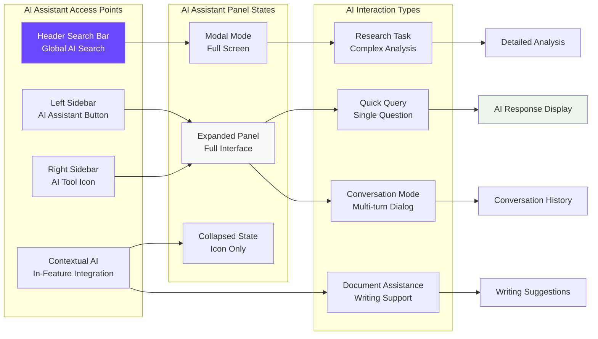

### **Project Creation and Management Workflow**

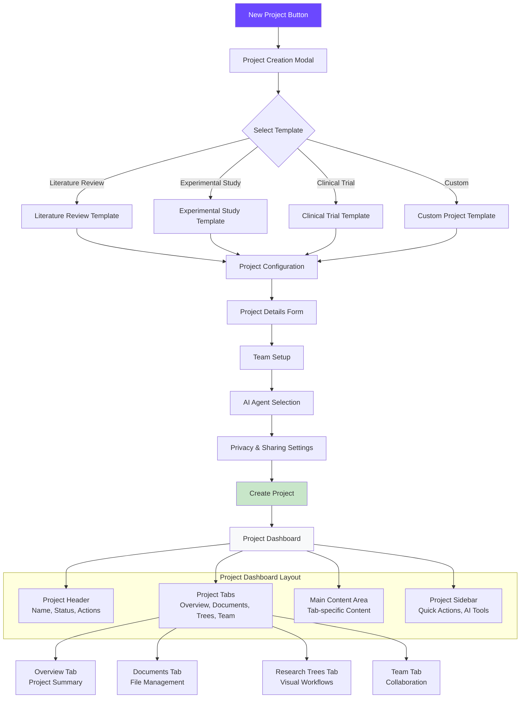

### **Real-Time Collaboration Touchpoints**

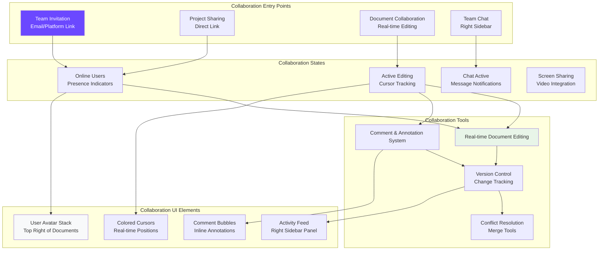

### **Research Trees Navigation and Editing Flow**

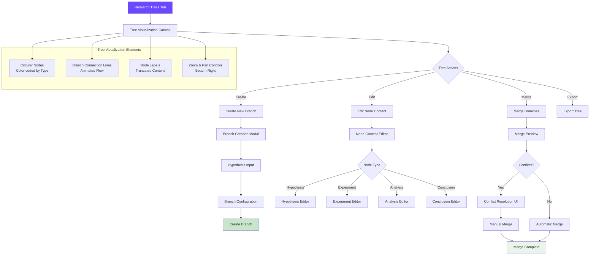

### **AI Agent Marketplace Discovery and Deployment**

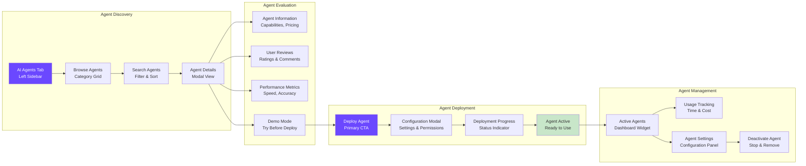

### **Complete User Journey Visual Map**

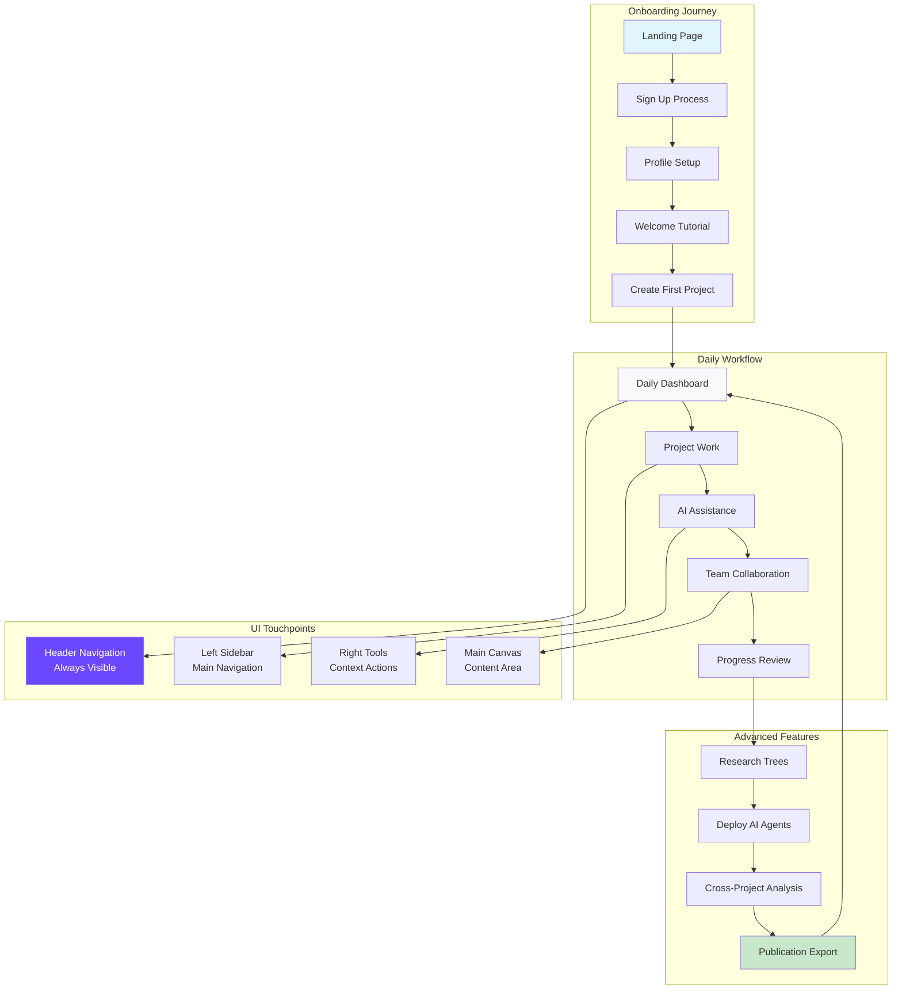

---

## **DESIGN SYSTEM INTEGRATION**

### **Consistent Visual Elements**

#### **Button System Hierarchy**

```mermaid
graph TD
    subgraph "Button Hierarchy"
        PRIMARY[Primary Buttons<br/>bg-purple-600 hover:bg-purple-700]
        SECONDARY[Secondary Buttons<br/>border-purple-600 text-purple-600]
        TERTIARY[Tertiary Buttons<br/>text-purple-600 hover:bg-purple-50]
        ICON_ONLY[Icon-Only Buttons<br/>p-2 rounded-lg hover:bg-purple-50]
    end

    subgraph "Button States"
        DEFAULT[Default State<br/>Normal Appearance]
        HOVER[Hover State<br/>Color Transition 0.25s]
        ACTIVE[Active State<br/>Pressed Appearance]
        DISABLED[Disabled State<br/>Opacity 50%]
        LOADING[Loading State<br/>Spinner Animation]
    end

    subgraph "Button Sizes"
        LARGE[Large (h-12 px-6)<br/>Main CTAs]
        MEDIUM[Medium (h-10 px-4)<br/>Standard Actions]
        SMALL[Small (h-8 px-3)<br/>Secondary Actions]
        ICON[Icon (h-8 w-8)<br/>Tool Buttons]
    end

    PRIMARY --> DEFAULT
    SECONDARY --> HOVER
    TERTIARY --> ACTIVE
    ICON_ONLY --> DISABLED

    style PRIMARY fill:#6B48FF,color:#fff
    style HOVER fill:#5B21B6,color:#fff
    style LARGE fill:#6B48FF,color:#fff
```

#### **Responsive Design Breakpoints**

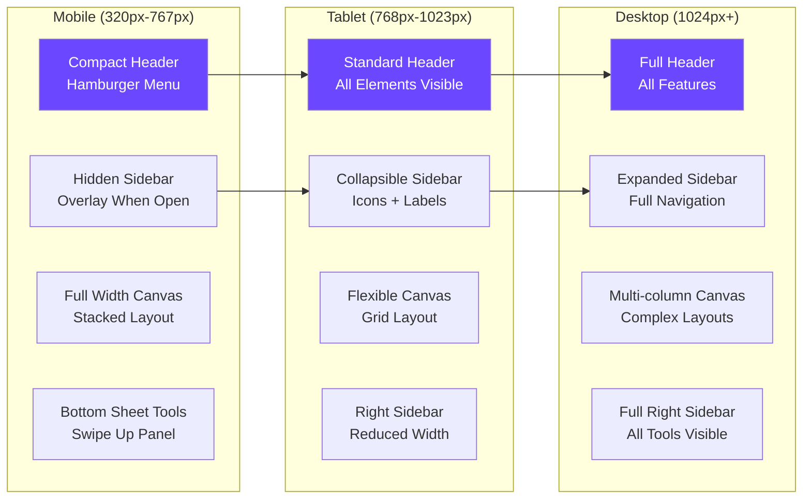

This comprehensive visual workflow documentation provides the complete foundation for implementing NeuraForge's user interface and user experience, ensuring consistency across all features while maintaining the highest standards of usability and accessibility.
