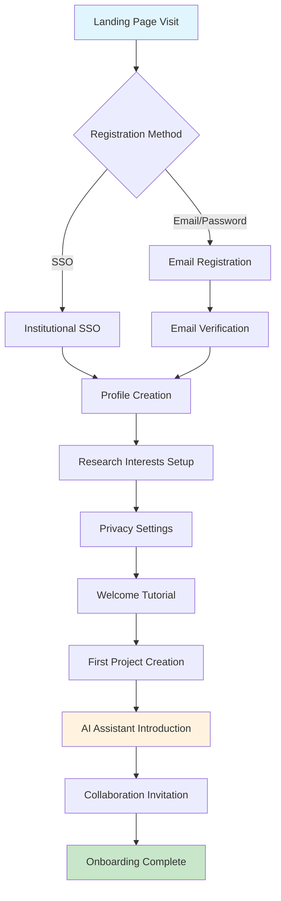
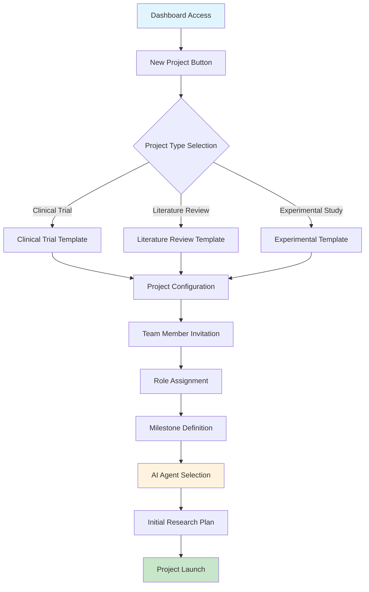
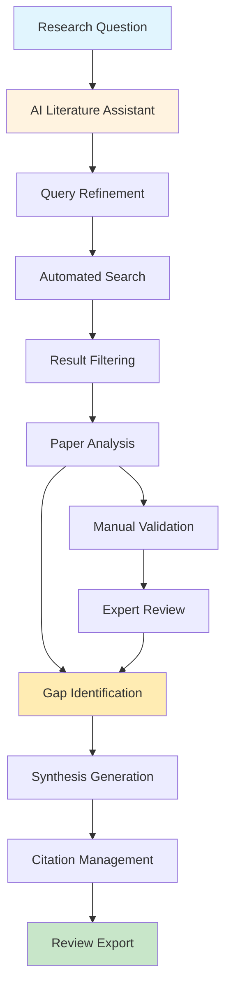
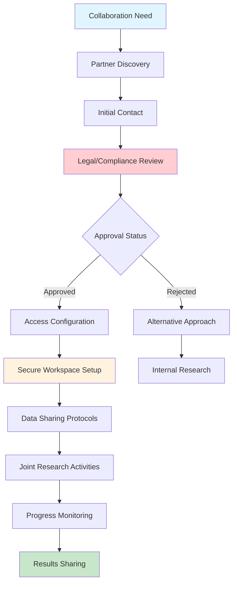
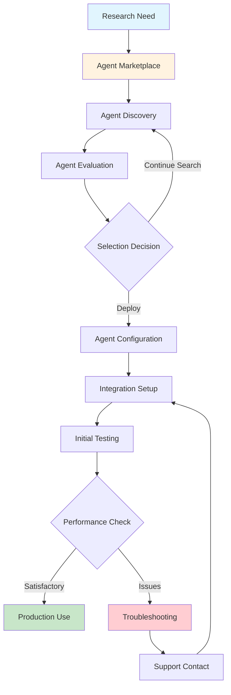

# NeuraForge User Journeys

## **Executive Summary**

This document maps end-to-end user workflows for NeuraForge's primary personas, providing detailed journey maps with decision points, pain points, and success criteria. Each journey includes Mermaid.js workflow diagrams for visual representation.

**Key Journeys Covered:**
1. New User Onboarding (All Personas)
2. Research Project Creation (Academic Research Lead)
3. AI-Assisted Literature Review (Independent Researcher)
4. Cross-Institutional Collaboration (Enterprise R&D Scientist)
5. AI Agent Deployment (All Personas)

---

## **JOURNEY 1: NEW USER ONBOARDING**

### **Journey Overview**
**Primary Persona**: All Users  
**Duration**: 15-20 minutes  
**Success Criteria**: User creates first project and invites collaborator  
**Key Touchpoints**: Registration, Profile Setup, First Project, AI Introduction

### **Journey Flow Diagram**

### **Detailed Journey Steps**

**Step 1: Discovery & Registration (2-3 minutes)**
- **Touchpoint**: Landing page with value proposition
- **User Action**: Clicks "Get Started" or "Sign Up"
- **System Response**: Registration form with SSO options
- **Pain Point**: Too many form fields can cause abandonment
- **Success Metric**: 85% registration completion rate

**Step 2: Profile Creation (3-5 minutes)**
- **Touchpoint**: Profile setup wizard
- **User Action**: Enters research background, interests, and institutional affiliation
- **System Response**: Suggests relevant research areas and potential collaborators
- **Pain Point**: Overwhelming number of research categories
- **Success Metric**: 80% profile completion rate

**Step 3: First Project Setup (5-7 minutes)**
- **Touchpoint**: Project creation interface with templates
- **User Action**: Selects template and customizes project details
- **System Response**: Creates project structure and suggests AI agents
- **Pain Point**: Unclear template differences and selection criteria
- **Success Metric**: 70% create first project within 24 hours

**Step 4: AI Introduction (3-5 minutes)**
- **Touchpoint**: Interactive AI assistant tutorial
- **User Action**: Asks sample research questions and explores capabilities
- **System Response**: Demonstrates literature search, hypothesis generation
- **Pain Point**: AI responses may be too technical or generic
- **Success Metric**: 60% complete AI tutorial and ask follow-up questions

---

## **JOURNEY 2: RESEARCH PROJECT CREATION**

### **Journey Overview**
**Primary Persona**: Dr. Sarah Chen (Academic Research Lead)  
**Duration**: 30-45 minutes  
**Success Criteria**: Project created with team members and initial research plan  
**Key Touchpoints**: Template Selection, Team Setup, Milestone Planning, AI Integration

### **Journey Flow Diagram**

### **Detailed Journey Steps**

**Step 1: Project Initiation (5 minutes)**
- **Context**: Dr. Chen has received NIH funding for a new biomedical study
- **User Action**: Navigates to dashboard and clicks "New Project"
- **System Response**: Displays project templates with descriptions and examples
- **Decision Point**: Chooses "Clinical Trial" template
- **Success Metric**: Template selection within 2 minutes

**Step 2: Project Configuration (10-15 minutes)**
- **User Action**: Fills in project details, research objectives, and timeline
- **System Response**: Validates inputs and suggests related projects
- **AI Assistance**: Recommends relevant literature and methodology
- **Pain Point**: Complex regulatory requirements for clinical trials
- **Success Metric**: Project configuration completed without errors

**Step 3: Team Assembly (10-15 minutes)**
- **User Action**: Invites team members via email or platform search
- **System Response**: Sends invitations and suggests role assignments
- **Collaboration**: Team members accept invitations and set up profiles
- **Pain Point**: External collaborators may need account creation
- **Success Metric**: 80% of invited members join within 48 hours

**Step 4: Research Planning (10-15 minutes)**
- **User Action**: Defines milestones, deliverables, and success criteria
- **AI Assistance**: Suggests timeline optimization and risk mitigation
- **System Response**: Creates project dashboard with progress tracking
- **Success Metric**: Initial research plan approved by all team members

---

## **JOURNEY 3: AI-ASSISTED LITERATURE REVIEW**

### **Journey Overview**
**Primary Persona**: Dr. Priya Patel (Independent Researcher)  
**Duration**: 2-3 hours (traditional: 8-12 hours)  
**Success Criteria**: Comprehensive literature review with gap analysis  
**Key Touchpoints**: Query Formulation, AI Search, Result Curation, Synthesis

### **Journey Flow Diagram**

### **Detailed Journey Steps**

**Step 1: Query Formulation (15 minutes)**
- **Context**: Dr. Patel is exploring novel approaches to cancer immunotherapy
- **User Action**: Enters research question in natural language
- **AI Response**: Suggests query refinements and search strategies
- **Iteration**: Refines query based on AI suggestions and domain knowledge
- **Success Metric**: Query generates 50-200 relevant papers

**Step 2: Automated Literature Search (5 minutes)**
- **AI Action**: Searches across arXiv, PubMed, Google Scholar, institutional databases
- **System Response**: Returns ranked results with relevance scores
- **User Action**: Reviews initial results and adjusts search parameters
- **Success Metric**: 80% of top 20 results are relevant to research question

**Step 3: Paper Analysis and Curation (60-90 minutes)**
- **AI Action**: Generates summaries for each paper with key findings
- **User Action**: Reviews summaries and selects papers for detailed analysis
- **AI Assistance**: Identifies methodological approaches and key insights
- **Collaboration**: Can share curated list with advisors or collaborators
- **Success Metric**: 30-50 papers selected for comprehensive review

**Step 4: Gap Analysis and Synthesis (45-60 minutes)**
- **AI Action**: Identifies research gaps and conflicting findings
- **User Action**: Validates AI analysis and adds domain expertise
- **System Response**: Generates structured literature review with citations
- **Output**: Publication-ready literature review with identified research opportunities
- **Success Metric**: Review identifies 3-5 clear research gaps

---

## **JOURNEY 4: CROSS-INSTITUTIONAL COLLABORATION**

### **Journey Overview**
**Primary Persona**: Dr. Michael Rodriguez (Enterprise R&D Scientist)  
**Duration**: 1-2 weeks setup, ongoing collaboration  
**Success Criteria**: Secure collaboration established with external partners  
**Key Touchpoints**: Partner Discovery, Legal Review, Access Setup, Joint Research

### **Journey Flow Diagram**

### **Detailed Journey Steps**

**Step 1: Partner Identification (2-3 days)**
- **Context**: Dr. Rodriguez needs expertise in novel drug delivery systems
- **User Action**: Searches platform for researchers with relevant expertise
- **AI Assistance**: Recommends potential collaborators based on research profiles
- **System Response**: Provides collaboration history and success metrics
- **Success Metric**: Identifies 3-5 potential partners within target criteria

**Step 2: Legal and Compliance Review (3-5 days)**
- **User Action**: Initiates collaboration request through platform
- **System Response**: Generates collaboration agreement template
- **Legal Review**: Both institutions review IP, data sharing, and publication terms
- **Pain Point**: Complex legal negotiations can delay collaboration
- **Success Metric**: 70% of collaboration requests approved within 1 week

**Step 3: Secure Workspace Configuration (1-2 days)**
- **System Action**: Creates isolated workspace with appropriate access controls
- **User Action**: Configures data sharing permissions and security settings
- **Compliance**: Ensures all activities meet regulatory requirements
- **Success Metric**: Workspace setup completed without security violations

**Step 4: Joint Research Execution (Ongoing)**
- **Collaboration**: Teams work together on shared research objectives
- **AI Assistance**: Facilitates communication and progress tracking
- **Monitoring**: System tracks contributions and maintains audit trail
- **Success Metric**: 90% of collaborative projects meet initial timeline goals

---

## **JOURNEY 5: AI AGENT DEPLOYMENT**

### **Journey Overview**
**Primary Persona**: All Users  
**Duration**: 10-15 minutes  
**Success Criteria**: AI agent successfully deployed and providing value  
**Key Touchpoints**: Agent Discovery, Evaluation, Deployment, Integration

### **Journey Flow Diagram**

### **Detailed Journey Steps**

**Step 1: Agent Discovery (3-5 minutes)**
- **Context**: User needs specialized analysis for genomic data
- **User Action**: Browses agent marketplace by category and capability
- **System Response**: Shows agents with ratings, pricing, and performance metrics
- **AI Assistance**: Recommends agents based on user's research profile
- **Success Metric**: User finds relevant agent within 5 minutes

**Step 2: Agent Evaluation (5-7 minutes)**
- **User Action**: Reviews agent documentation, examples, and user reviews
- **System Response**: Provides trial access or demo capabilities
- **Decision Factors**: Performance metrics, cost, integration complexity
- **Success Metric**: 80% of evaluated agents meet user requirements

**Step 3: Agent Deployment (2-3 minutes)**
- **User Action**: Configures agent parameters and access permissions
- **System Response**: Deploys agent to user's workspace
- **Integration**: Agent connects to relevant data sources and tools
- **Success Metric**: Agent deployment completes without errors

**Step 4: Performance Validation (5-10 minutes)**
- **User Action**: Tests agent with sample data and research questions
- **Agent Response**: Provides analysis results and recommendations
- **Validation**: User compares results with expected outcomes
- **Success Metric**: 90% of deployed agents meet performance expectations

---

## **CROSS-JOURNEY INSIGHTS**

### **Common Pain Points**
1. **Complexity Overwhelm**: Too many options can paralyze decision-making
2. **Integration Friction**: Difficulty connecting with existing tools and workflows
3. **Trust Building**: Users need confidence in AI recommendations and security
4. **Learning Curve**: Advanced features require significant time investment

### **Success Enablers**
1. **Progressive Disclosure**: Show advanced features only when needed
2. **Smart Defaults**: Pre-configure settings based on user profile and context
3. **Contextual Help**: Provide assistance exactly when and where needed
4. **Social Proof**: Show success stories and peer recommendations

### **Optimization Opportunities**
1. **Onboarding Acceleration**: Reduce time to first value from 20 to 10 minutes
2. **AI Proactivity**: Anticipate user needs and provide suggestions
3. **Collaboration Friction**: Streamline external user invitation and access
4. **Mobile Optimization**: Enable key workflows on mobile devices

---

## **JOURNEY METRICS & KPIs**

### **Onboarding Success Metrics**
- Registration to first project: <24 hours (Target: 70%)
- Profile completion rate: >80%
- Tutorial completion rate: >60%
- First collaboration invitation: <48 hours (Target: 50%)

### **Research Productivity Metrics**
- Literature review time reduction: >60%
- Project setup time: <30 minutes
- Collaboration response rate: >80%
- AI agent adoption rate: >70%

### **User Satisfaction Metrics**
- Net Promoter Score: >50
- Feature satisfaction rating: >4.0/5.0
- Support ticket volume: <2% of monthly active users
- User retention (30-day): >75%

These user journeys provide the foundation for UX design, feature prioritization, and user experience optimization across all NeuraForge touchpoints.
