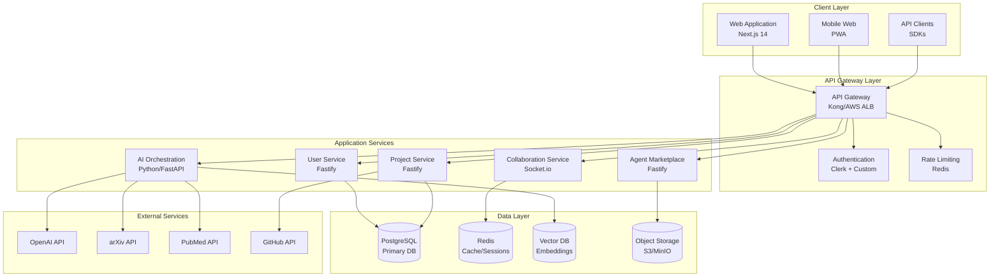
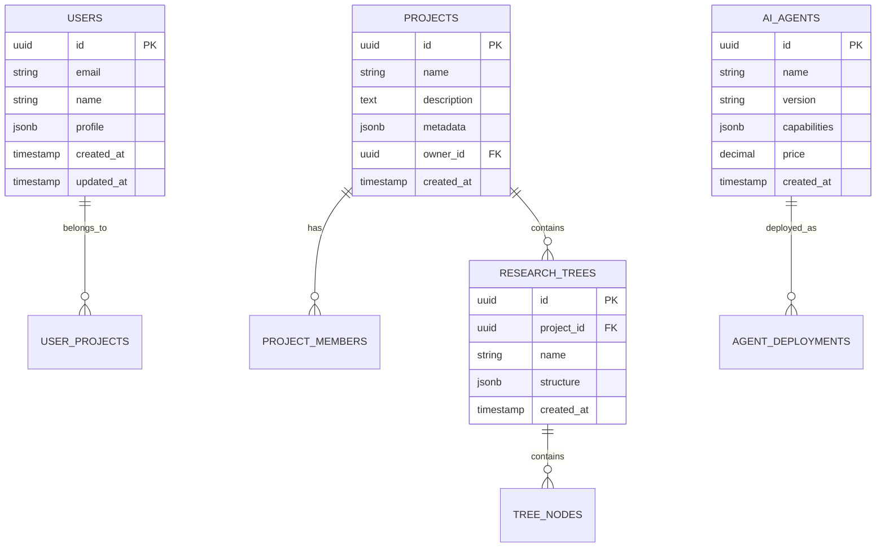
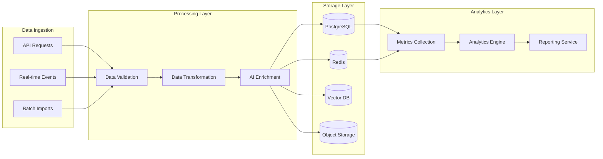
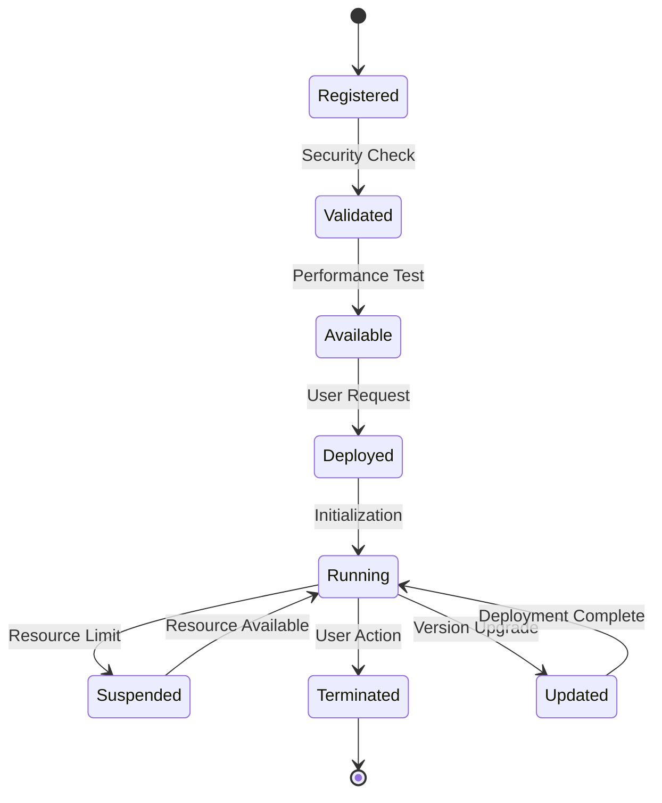
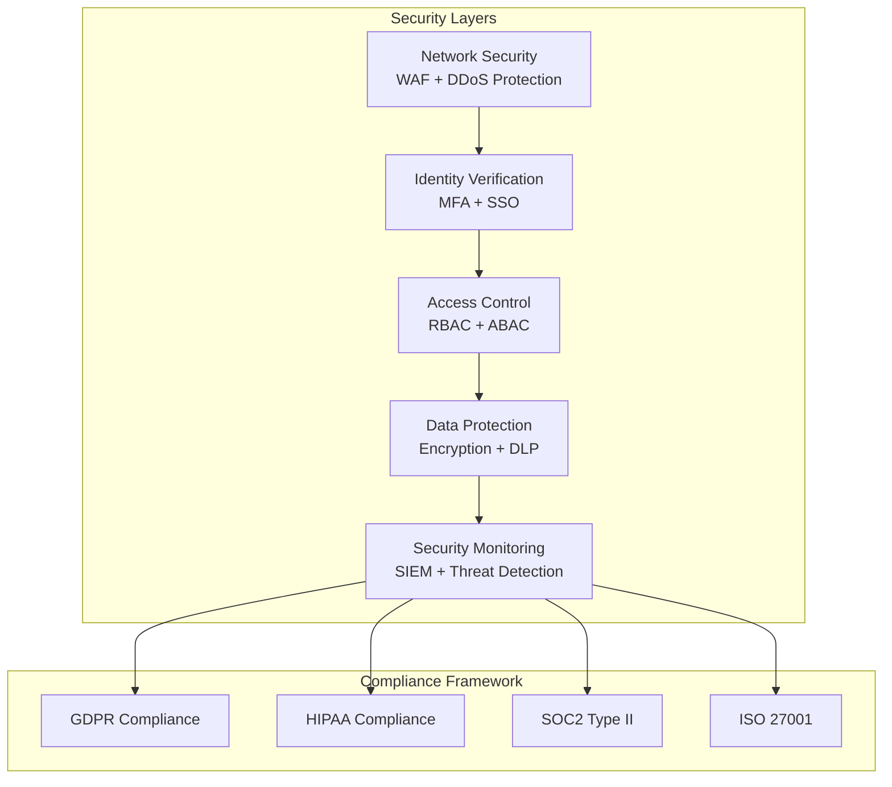
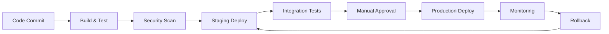

# NeuraForge System Design

## **Executive Summary**

This document outlines the high-level system architecture for NeuraForge, designed to support 25,000+ concurrent researchers with AI-native collaboration capabilities. The architecture emphasizes scalability, security, and real-time performance while maintaining the flexibility to integrate with diverse research tools and institutions.

**Key Architecture Principles:**
- **Microservices Design**: Independently scalable services
- **AI-Native Integration**: Built-in support for AI agent orchestration
- **Real-Time Collaboration**: Sub-50ms latency for collaborative features
- **Enterprise Security**: Zero-trust architecture with end-to-end encryption

---

## **SYSTEM ARCHITECTURE OVERVIEW**

### **High-Level Architecture Diagram**



---

## **MICROSERVICES ARCHITECTURE**

### **Core Services Design**

**1. User Management Service**
- **Technology**: Fastify + TypeScript
- **Responsibilities**: Authentication, authorization, profile management
- **Database**: PostgreSQL (user profiles, permissions)
- **Scaling**: Horizontal with load balancing
- **SLA**: 99.9% uptime, <100ms response time

```typescript
interface UserService {
  authentication: ClerkIntegration
  profiles: UserProfileManager
  permissions: RBACEngine
  institutions: InstitutionManager
  compliance: ComplianceTracker
}
```

**2. Project Management Service**
- **Technology**: Fastify + TypeScript
- **Responsibilities**: Project CRUD, team management, milestone tracking
- **Database**: PostgreSQL (projects, teams, milestones)
- **Integration**: GitHub API, institutional systems
- **SLA**: 99.9% uptime, <200ms response time

**3. Real-Time Collaboration Service**
- **Technology**: Socket.io + Redis
- **Responsibilities**: Real-time editing, chat, presence awareness
- **Database**: Redis (session state, operational transforms)
- **Performance**: <50ms latency, 10,000 concurrent connections
- **SLA**: 99.95% uptime, <50ms latency

**4. AI Orchestration Service**
- **Technology**: Python + FastAPI
- **Responsibilities**: AI agent management, model inference, context management
- **Database**: Vector database (embeddings), Redis (cache)
- **Integration**: OpenAI, HuggingFace, custom models
- **SLA**: 99.9% uptime, <3s response time

**5. Agent Marketplace Service**
- **Technology**: Fastify + TypeScript
- **Responsibilities**: Agent discovery, deployment, billing
- **Database**: PostgreSQL (agent metadata), S3 (agent artifacts)
- **Features**: Version control, performance monitoring
- **SLA**: 99.9% uptime, <500ms response time

### **Service Communication Patterns**

**Synchronous Communication:**
- REST APIs for CRUD operations
- GraphQL for complex queries
- gRPC for internal service communication

**Asynchronous Communication:**
- Event-driven architecture with message queues
- WebSocket connections for real-time features
- Pub/Sub patterns for notifications

---

## **DATA ARCHITECTURE**

### **Database Design Strategy**

**Primary Database: PostgreSQL**


**Caching Layer: Redis**
- Session management and user state
- Real-time collaboration operational transforms
- API response caching with TTL
- Rate limiting counters
- WebSocket connection management

**Vector Database: Pinecone/Weaviate**
- Research paper embeddings
- User profile embeddings for matching
- AI agent capability embeddings
- Semantic search and recommendation engine

**Object Storage: S3/MinIO**
- Research documents and datasets
- AI agent artifacts and models
- User-uploaded files and media
- Backup and archival storage

### **Data Flow Architecture**



---

## **AI AGENT ORCHESTRATION**

### **Agent Architecture Design**

**Agent Lifecycle Management:**


**Agent Communication Framework:**
```typescript
interface AgentOrchestrator {
  registry: AgentRegistry
  deployment: DeploymentManager
  monitoring: PerformanceMonitor
  billing: UsageTracker
  security: SecurityValidator
}

interface ResearchAgent {
  id: string
  capabilities: AgentCapability[]
  resources: ResourceRequirements
  performance: PerformanceMetrics
  communicate(message: AgentMessage): Promise<AgentResponse>
}
```

**Agent Types and Specializations:**
- **Literature Agents**: Paper analysis, citation tracking, trend identification
- **Experimental Agents**: Design optimization, statistical analysis, result interpretation
- **Collaboration Agents**: Team matching, conflict resolution, project coordination
- **Domain Agents**: Field-specific expertise (biotech, climate, AI safety)

---

## **SCALABILITY PATTERNS**

### **Horizontal Scaling Strategy**

**Load Balancing:**
- Application Load Balancer (ALB) with health checks
- Round-robin distribution with session affinity
- Auto-scaling based on CPU/memory metrics
- Geographic load balancing for global users

**Database Scaling:**
- Read replicas for query distribution
- Connection pooling with PgBouncer
- Partitioning for large tables (users, projects)
- Caching layer to reduce database load

**Microservice Scaling:**
- Container orchestration with Kubernetes
- Horizontal Pod Autoscaler (HPA) based on metrics
- Resource quotas and limits per service
- Circuit breakers for fault tolerance

### **Performance Optimization**

**Frontend Optimization:**
- Code splitting and lazy loading
- CDN for static assets
- Service worker for offline capabilities
- Bundle optimization with Webpack/Vite

**Backend Optimization:**
- Database query optimization with indexes
- API response caching with Redis
- Async processing for heavy operations
- Connection pooling and keep-alive

**Real-Time Performance:**
- WebSocket connection pooling
- Operational transform algorithms for conflict resolution
- Message queuing for reliable delivery
- Presence awareness optimization

---

## **SECURITY ARCHITECTURE**

### **Zero-Trust Security Model**



**Security Controls:**
- **Authentication**: Multi-factor authentication with Clerk integration
- **Authorization**: Role-based access control with fine-grained permissions
- **Encryption**: AES-256 for data at rest, TLS 1.3 for data in transit
- **Audit Logging**: Immutable audit trail for all user actions
- **Threat Detection**: Real-time monitoring and automated response

### **Data Privacy Framework**

**Privacy by Design:**
- Minimal data collection with explicit consent
- Data anonymization and pseudonymization
- Right to be forgotten implementation
- Cross-border data transfer compliance

**Compliance Implementation:**
- GDPR: Data subject rights, consent management, breach notification
- HIPAA: PHI protection, access controls, audit logging
- SOC2: Security controls, availability, confidentiality

---

## **INTEGRATION ARCHITECTURE**

### **External Service Integration**

**Research Tool Integrations:**
- **GitHub**: Repository management, version control
- **Jupyter**: Notebook execution and sharing
- **arXiv/PubMed**: Literature search and retrieval
- **ORCID**: Researcher identification and verification

**Enterprise Integrations:**
- **SSO Providers**: SAML 2.0, OAuth 2.0, LDAP
- **Institutional Systems**: LIMS, ERP, HR systems
- **Cloud Providers**: AWS, Google Cloud, Azure
- **Compliance Tools**: Audit systems, security scanners

### **API Design Principles**

**RESTful API Standards:**
- OpenAPI 3.0 specification
- Consistent resource naming and HTTP methods
- Proper status codes and error handling
- Versioning strategy with backward compatibility

**GraphQL Implementation:**
- Flexible query capabilities for complex data relationships
- Real-time subscriptions for live updates
- Schema stitching for microservice integration
- Performance optimization with DataLoader

---

## **MONITORING AND OBSERVABILITY**

### **Observability Stack**

**Metrics Collection:**
- Application metrics: Response time, throughput, error rate
- Infrastructure metrics: CPU, memory, disk, network
- Business metrics: User engagement, feature adoption
- Custom metrics: AI agent performance, collaboration effectiveness

**Logging Strategy:**
- Structured logging with JSON format
- Centralized log aggregation with ELK stack
- Log retention policies for compliance
- Real-time log analysis and alerting

**Distributed Tracing:**
- Request tracing across microservices
- Performance bottleneck identification
- Error propagation tracking
- Service dependency mapping

### **Alerting and Incident Response**

**Alert Categories:**
- **Critical**: Service outages, security breaches
- **Warning**: Performance degradation, resource limits
- **Info**: Deployment notifications, maintenance windows

**Incident Response:**
- Automated incident detection and escalation
- Runbook automation for common issues
- Post-incident review and improvement process
- Communication templates for user notifications

---

## **DEPLOYMENT ARCHITECTURE**

### **Infrastructure as Code**

**Container Orchestration:**
- Kubernetes for container management
- Helm charts for application deployment
- GitOps workflow with ArgoCD
- Multi-environment promotion pipeline

**Cloud Infrastructure:**
- Terraform for infrastructure provisioning
- Multi-cloud strategy for vendor independence
- Auto-scaling groups for high availability
- Disaster recovery with cross-region replication

### **CI/CD Pipeline**



**Deployment Strategy:**
- Blue-green deployments for zero downtime
- Canary releases for gradual rollout
- Feature flags for controlled feature activation
- Automated rollback on failure detection

This system design provides the foundation for building a scalable, secure, and performant research collaboration platform that can grow from thousands to millions of users while maintaining the highest standards of reliability and user experience.
