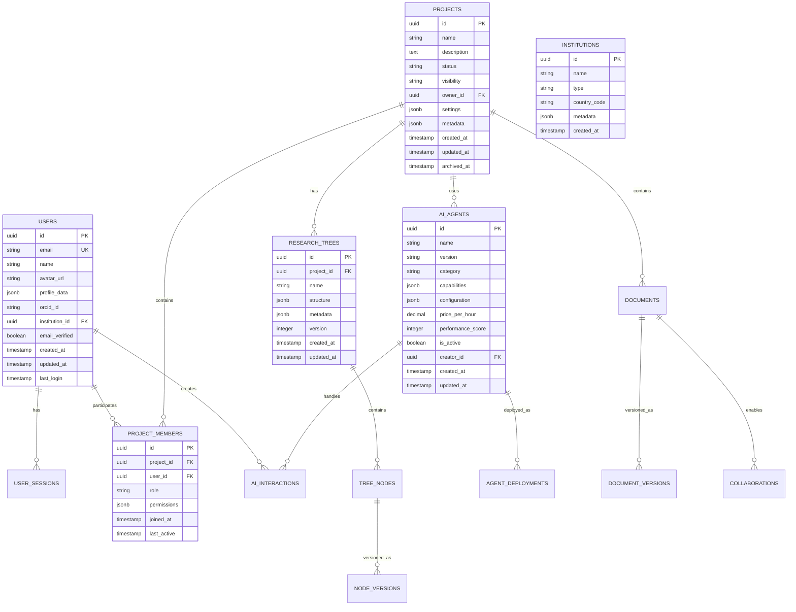

# NeuraForge Database Schema

## **Executive Summary**

This document defines the comprehensive database schema for NeuraForge, including PostgreSQL primary database, Redis caching layer, and vector database for AI embeddings. The schema is designed to support 25,000+ concurrent users with ACID compliance and horizontal scaling capabilities.

**Database Technologies:**
- **PostgreSQL 15+**: Primary relational database
- **Redis 7+**: Caching and session management
- **Pinecone/Weaviate**: Vector database for embeddings
- **S3/MinIO**: Object storage for files and artifacts

---

## **POSTGRESQL SCHEMA**

### **Core Entity Relationship Diagram**



### **Table Definitions**

**Users Table:**
```sql
CREATE TABLE users (
    id UUID PRIMARY KEY DEFAULT gen_random_uuid(),
    email VARCHAR(255) UNIQUE NOT NULL,
    name VARCHAR(255) NOT NULL,
    avatar_url TEXT,
    profile_data JSONB DEFAULT '{}',
    orcid_id VARCHAR(50),
    institution_id UUID REFERENCES institutions(id),
    email_verified BOOLEAN DEFAULT FALSE,
    created_at TIMESTAMP WITH TIME ZONE DEFAULT NOW(),
    updated_at TIMESTAMP WITH TIME ZONE DEFAULT NOW(),
    last_login TIMESTAMP WITH TIME ZONE
);

CREATE INDEX idx_users_email ON users(email);
CREATE INDEX idx_users_institution ON users(institution_id);
CREATE INDEX idx_users_created_at ON users(created_at);
```

**Projects Table:**
```sql
CREATE TABLE projects (
    id UUID PRIMARY KEY DEFAULT gen_random_uuid(),
    name VARCHAR(200) NOT NULL,
    description TEXT,
    status VARCHAR(20) DEFAULT 'active' CHECK (status IN ('active', 'completed', 'archived')),
    visibility VARCHAR(20) DEFAULT 'private' CHECK (visibility IN ('private', 'internal', 'public')),
    owner_id UUID NOT NULL REFERENCES users(id) ON DELETE CASCADE,
    settings JSONB DEFAULT '{}',
    metadata JSONB DEFAULT '{}',
    created_at TIMESTAMP WITH TIME ZONE DEFAULT NOW(),
    updated_at TIMESTAMP WITH TIME ZONE DEFAULT NOW(),
    archived_at TIMESTAMP WITH TIME ZONE
);

CREATE INDEX idx_projects_owner ON projects(owner_id);
CREATE INDEX idx_projects_status ON projects(status);
CREATE INDEX idx_projects_created_at ON projects(created_at);
CREATE INDEX idx_projects_visibility ON projects(visibility);
```

**AI Agents Table:**
```sql
CREATE TABLE ai_agents (
    id UUID PRIMARY KEY DEFAULT gen_random_uuid(),
    name VARCHAR(255) NOT NULL,
    version VARCHAR(50) NOT NULL,
    category VARCHAR(100) NOT NULL,
    capabilities JSONB NOT NULL DEFAULT '[]',
    configuration JSONB DEFAULT '{}',
    price_per_hour DECIMAL(10,4) DEFAULT 0.0000,
    performance_score INTEGER DEFAULT 0 CHECK (performance_score >= 0 AND performance_score <= 100),
    is_active BOOLEAN DEFAULT TRUE,
    creator_id UUID REFERENCES users(id),
    created_at TIMESTAMP WITH TIME ZONE DEFAULT NOW(),
    updated_at TIMESTAMP WITH TIME ZONE DEFAULT NOW(),
    
    UNIQUE(name, version)
);

CREATE INDEX idx_ai_agents_category ON ai_agents(category);
CREATE INDEX idx_ai_agents_active ON ai_agents(is_active);
CREATE INDEX idx_ai_agents_performance ON ai_agents(performance_score DESC);
```

### **Advanced Schema Features**

**Research Trees with Version Control:**
```sql
CREATE TABLE research_trees (
    id UUID PRIMARY KEY DEFAULT gen_random_uuid(),
    project_id UUID NOT NULL REFERENCES projects(id) ON DELETE CASCADE,
    name VARCHAR(255) NOT NULL,
    structure JSONB NOT NULL DEFAULT '{"nodes": [], "edges": []}',
    metadata JSONB DEFAULT '{}',
    version INTEGER DEFAULT 1,
    parent_version_id UUID REFERENCES research_trees(id),
    created_at TIMESTAMP WITH TIME ZONE DEFAULT NOW(),
    updated_at TIMESTAMP WITH TIME ZONE DEFAULT NOW()
);

CREATE INDEX idx_research_trees_project ON research_trees(project_id);
CREATE INDEX idx_research_trees_version ON research_trees(version);
```

**Collaboration Tracking:**
```sql
CREATE TABLE collaborations (
    id UUID PRIMARY KEY DEFAULT gen_random_uuid(),
    document_id UUID NOT NULL REFERENCES documents(id) ON DELETE CASCADE,
    user_id UUID NOT NULL REFERENCES users(id) ON DELETE CASCADE,
    operation_type VARCHAR(50) NOT NULL,
    operation_data JSONB NOT NULL,
    position INTEGER,
    timestamp TIMESTAMP WITH TIME ZONE DEFAULT NOW(),
    session_id VARCHAR(255)
);

CREATE INDEX idx_collaborations_document ON collaborations(document_id);
CREATE INDEX idx_collaborations_timestamp ON collaborations(timestamp);
CREATE INDEX idx_collaborations_session ON collaborations(session_id);
```

---

## **REDIS SCHEMA**

### **Cache Structure Design**

**Session Management:**
```redis
# User sessions
user:session:{session_id} -> {
    "user_id": "uuid",
    "expires_at": "timestamp",
    "permissions": ["read", "write"],
    "last_activity": "timestamp"
}
TTL: 24 hours

# User presence
user:presence:{user_id} -> {
    "status": "online|away|offline",
    "last_seen": "timestamp",
    "current_project": "project_id"
}
TTL: 5 minutes
```

**Real-Time Collaboration:**
```redis
# Document locks
doc:lock:{document_id} -> {
    "user_id": "uuid",
    "locked_at": "timestamp",
    "operation": "editing"
}
TTL: 30 seconds

# Operational transforms
doc:ops:{document_id} -> [
    {
        "user_id": "uuid",
        "operation": "insert|delete|retain",
        "position": 123,
        "content": "text",
        "timestamp": "timestamp"
    }
]
TTL: 1 hour
```

**API Rate Limiting:**
```redis
# Rate limit counters
rate_limit:{user_id}:{endpoint} -> count
TTL: 1 hour

# Rate limit windows
rate_limit:window:{user_id}:{endpoint} -> {
    "requests": 45,
    "window_start": "timestamp",
    "limit": 100
}
TTL: 1 hour
```

**Caching Strategy:**
```redis
# API response caching
api:cache:{endpoint}:{params_hash} -> {
    "data": "response_data",
    "cached_at": "timestamp"
}
TTL: 15 minutes

# User profile caching
user:profile:{user_id} -> {
    "name": "string",
    "avatar_url": "string",
    "research_interests": ["array"]
}
TTL: 1 hour
```

---

## **VECTOR DATABASE SCHEMA**

### **Embedding Collections**

**Research Papers Collection:**
```python
# Pinecone/Weaviate schema
papers_collection = {
    "name": "research_papers",
    "dimension": 1536,  # OpenAI embedding dimension
    "metric": "cosine",
    "metadata_config": {
        "indexed": ["title", "authors", "journal", "year", "doi"]
    }
}

# Vector structure
paper_vector = {
    "id": "paper_arxiv_2301.12345",
    "values": [0.1, -0.2, 0.3, ...],  # 1536 dimensions
    "metadata": {
        "title": "Novel Approach to AI Research",
        "authors": ["Dr. Smith", "Dr. Jones"],
        "journal": "Nature AI",
        "year": 2024,
        "doi": "10.1038/s41586-024-12345",
        "abstract": "Full abstract text...",
        "categories": ["machine-learning", "nlp"]
    }
}
```

**User Profile Embeddings:**
```python
users_collection = {
    "name": "user_profiles",
    "dimension": 384,  # Sentence transformer dimension
    "metric": "cosine",
    "metadata_config": {
        "indexed": ["user_id", "institution", "research_domains"]
    }
}

user_vector = {
    "id": f"user_{user_id}",
    "values": [0.2, -0.1, 0.4, ...],  # 384 dimensions
    "metadata": {
        "user_id": "uuid",
        "research_interests": ["AI", "machine learning"],
        "institution": "MIT",
        "h_index": 25,
        "recent_papers": ["paper_id_1", "paper_id_2"]
    }
}
```

**AI Agent Capabilities:**
```python
agents_collection = {
    "name": "ai_agents",
    "dimension": 768,
    "metric": "cosine",
    "metadata_config": {
        "indexed": ["category", "capabilities", "performance_score"]
    }
}
```

---

## **DATA MIGRATION STRATEGY**

### **Migration Framework**

**Version Control for Schema:**
```sql
CREATE TABLE schema_migrations (
    version VARCHAR(50) PRIMARY KEY,
    description TEXT NOT NULL,
    applied_at TIMESTAMP WITH TIME ZONE DEFAULT NOW(),
    rollback_sql TEXT
);
```

**Migration Scripts Structure:**
```
migrations/
├── 001_initial_schema.sql
├── 002_add_research_trees.sql
├── 003_ai_agents_table.sql
├── 004_collaboration_tracking.sql
└── rollback/
    ├── 001_rollback.sql
    ├── 002_rollback.sql
    └── ...
```

### **Data Seeding Strategy**

**Development Seed Data:**
```sql
-- Insert test institutions
INSERT INTO institutions (id, name, type, country_code) VALUES
('550e8400-e29b-41d4-a716-446655440000', 'MIT', 'university', 'US'),
('550e8400-e29b-41d4-a716-446655440001', 'Stanford', 'university', 'US'),
('550e8400-e29b-41d4-a716-446655440002', 'Google Research', 'company', 'US');

-- Insert test users
INSERT INTO users (id, email, name, institution_id) VALUES
('660e8400-e29b-41d4-a716-446655440000', 'researcher@mit.edu', 'Dr. Sarah Chen', '550e8400-e29b-41d4-a716-446655440000');
```

---

## **PERFORMANCE OPTIMIZATION**

### **Indexing Strategy**

**Composite Indexes:**
```sql
-- Project member queries
CREATE INDEX idx_project_members_project_user ON project_members(project_id, user_id);

-- AI interaction queries
CREATE INDEX idx_ai_interactions_user_timestamp ON ai_interactions(user_id, created_at DESC);

-- Research tree queries
CREATE INDEX idx_research_trees_project_version ON research_trees(project_id, version DESC);
```

**Partial Indexes:**
```sql
-- Active projects only
CREATE INDEX idx_projects_active ON projects(created_at DESC) WHERE status = 'active';

-- Verified users only
CREATE INDEX idx_users_verified_email ON users(email) WHERE email_verified = TRUE;
```

### **Query Optimization**

**Materialized Views:**
```sql
-- Project statistics
CREATE MATERIALIZED VIEW project_stats AS
SELECT 
    p.id,
    p.name,
    COUNT(pm.user_id) as member_count,
    COUNT(d.id) as document_count,
    MAX(d.updated_at) as last_activity
FROM projects p
LEFT JOIN project_members pm ON p.id = pm.project_id
LEFT JOIN documents d ON p.id = d.project_id
GROUP BY p.id, p.name;

CREATE UNIQUE INDEX idx_project_stats_id ON project_stats(id);
```

**Connection Pooling:**
```javascript
// PgBouncer configuration
const pool = new Pool({
    host: 'localhost',
    port: 6432,  // PgBouncer port
    database: 'neuraforge',
    user: 'app_user',
    password: process.env.DB_PASSWORD,
    max: 20,  // Maximum connections
    idleTimeoutMillis: 30000,
    connectionTimeoutMillis: 2000,
});
```

---

## **BACKUP AND RECOVERY**

### **Backup Strategy**

**PostgreSQL Backup:**
```bash
# Daily full backup
pg_dump -h localhost -U postgres -d neuraforge -f backup_$(date +%Y%m%d).sql

# Continuous WAL archiving
archive_command = 'cp %p /backup/wal_archive/%f'
```

**Redis Backup:**
```bash
# Redis persistence configuration
save 900 1      # Save if at least 1 key changed in 900 seconds
save 300 10     # Save if at least 10 keys changed in 300 seconds
save 60 10000   # Save if at least 10000 keys changed in 60 seconds
```

### **Disaster Recovery**

**Recovery Time Objectives:**
- **RTO**: 4 hours maximum downtime
- **RPO**: 15 minutes maximum data loss
- **Backup Retention**: 30 days daily, 12 months monthly

**Recovery Procedures:**
1. Restore PostgreSQL from latest backup
2. Apply WAL files for point-in-time recovery
3. Restore Redis from latest snapshot
4. Verify data integrity and consistency
5. Update DNS and resume operations

This database schema provides a robust foundation for NeuraForge's data management needs, ensuring scalability, performance, and data integrity across all platform features.
