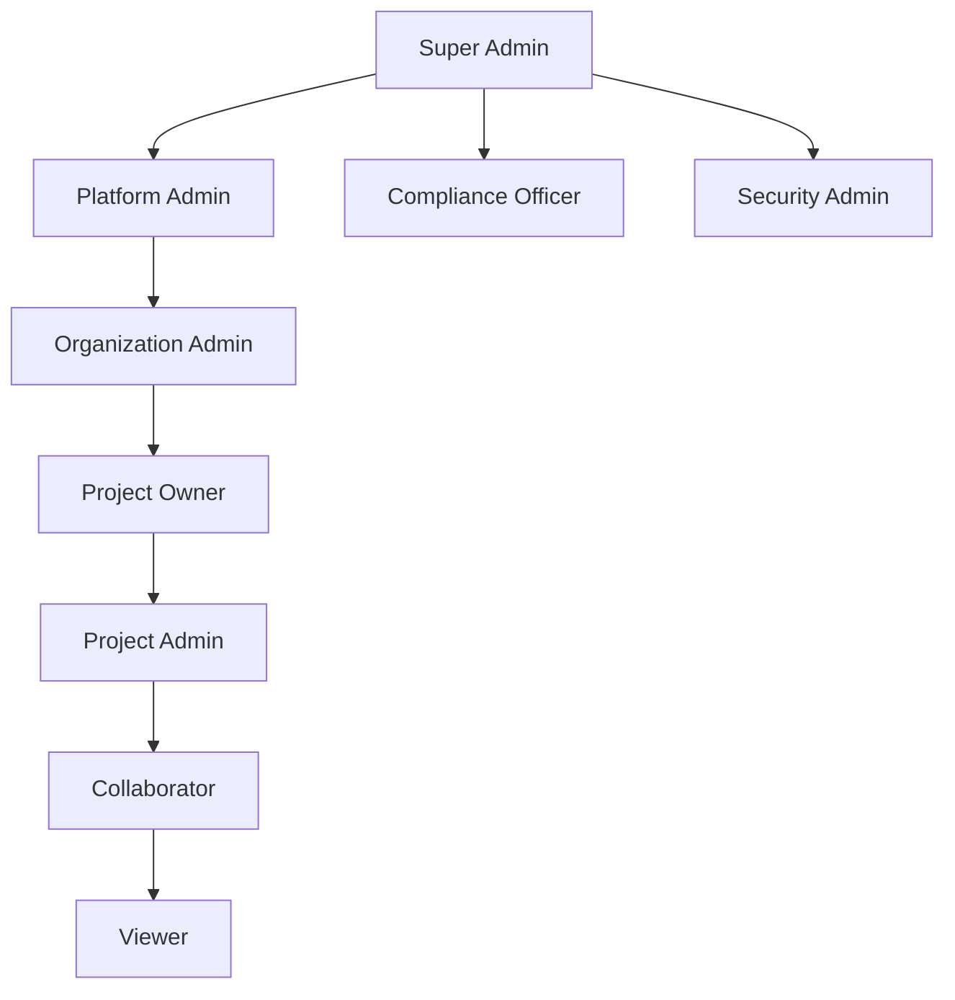

# NeuraForge Security Model

## **Executive Summary**

This document outlines NeuraForge's comprehensive security framework, implementing zero-trust architecture with enterprise-grade controls for research data protection. The security model addresses authentication, authorization, data encryption, compliance requirements, and threat detection.

**Security Objectives:**
- **Confidentiality**: Protect sensitive research data and IP
- **Integrity**: Ensure data accuracy and prevent tampering
- **Availability**: Maintain 99.9% uptime with DDoS protection
- **Compliance**: Meet GDPR, HIPAA, SOC2, and institutional requirements

---

## **AUTHENTICATION FRAMEWORK**

### **Multi-Factor Authentication (MFA)**

**Clerk Integration with Enhanced Security:**
```typescript
interface AuthenticationConfig {
  mfaRequired: boolean
  allowedMethods: ['password', 'sso', 'passkey']
  sessionTimeout: number // 24 hours
  passwordPolicy: {
    minLength: 12
    requireUppercase: true
    requireNumbers: true
    requireSpecialChars: true
    preventReuse: 5 // last 5 passwords
  }
  lockoutPolicy: {
    maxAttempts: 5
    lockoutDuration: 900 // 15 minutes
  }
}
```

**SSO Integration:**
- SAML 2.0 for enterprise customers
- OAuth 2.0 with PKCE for third-party integrations
- ORCID integration for researcher verification
- Institutional identity providers (Shibboleth, CAS)

### **Session Management**

**Secure Session Handling:**
```typescript
interface SessionSecurity {
  tokenType: 'JWT'
  algorithm: 'RS256'
  expiration: 86400 // 24 hours
  refreshTokenRotation: true
  httpOnlyCookies: true
  sameSitePolicy: 'Strict'
  secureFlag: true
}
```

**Session Monitoring:**
- Concurrent session limits (5 per user)
- Geolocation anomaly detection
- Device fingerprinting for suspicious activity
- Automatic logout on inactivity (2 hours)

---

## **AUTHORIZATION MODEL**

### **Role-Based Access Control (RBAC)**

**Role Hierarchy:**


**Permission Matrix:**
| Role | Create Project | Invite Users | Manage AI Agents | View Analytics | Admin Settings |
|------|----------------|--------------|------------------|----------------|----------------|
| Super Admin | ✓ | ✓ | ✓ | ✓ | ✓ |
| Platform Admin | ✓ | ✓ | ✓ | ✓ | ✓ |
| Org Admin | ✓ | ✓ | ✓ | ✓ | ✗ |
| Project Owner | ✓ | ✓ | ✓ | ✓ | ✗ |
| Project Admin | ✗ | ✓ | ✓ | ✓ | ✗ |
| Collaborator | ✗ | ✗ | ✓ | ✗ | ✗ |
| Viewer | ✗ | ✗ | ✗ | ✗ | ✗ |

### **Attribute-Based Access Control (ABAC)**

**Dynamic Permission Evaluation:**
```typescript
interface AccessPolicy {
  subject: {
    userId: string
    roles: string[]
    institution: string
    clearanceLevel?: string
  }
  resource: {
    type: 'project' | 'document' | 'agent' | 'data'
    id: string
    classification: 'public' | 'internal' | 'confidential' | 'restricted'
    owner: string
  }
  action: 'read' | 'write' | 'delete' | 'share' | 'export'
  context: {
    time: Date
    location: string
    networkType: 'internal' | 'external'
    deviceTrust: 'trusted' | 'untrusted'
  }
}
```

**Policy Examples:**
- Restrict export of confidential data to trusted devices only
- Limit access to restricted projects during business hours
- Require additional approval for cross-institutional data sharing
- Block access from high-risk geographic locations

---

## **DATA ENCRYPTION**

### **Encryption at Rest**

**Database Encryption:**
```sql
-- PostgreSQL Transparent Data Encryption (TDE)
CREATE TABLE sensitive_research_data (
    id UUID PRIMARY KEY,
    encrypted_content BYTEA, -- AES-256-GCM encrypted
    encryption_key_id VARCHAR(255),
    created_at TIMESTAMP WITH TIME ZONE DEFAULT NOW()
);
```

**Key Management:**
- AWS KMS / Azure Key Vault for key storage
- Key rotation every 90 days
- Separate keys for different data classifications
- Hardware Security Module (HSM) for high-value keys

### **Encryption in Transit**

**TLS Configuration:**
```nginx
# Nginx TLS configuration
ssl_protocols TLSv1.3;
ssl_ciphers ECDHE-ECDSA-AES256-GCM-SHA384:ECDHE-RSA-AES256-GCM-SHA384;
ssl_prefer_server_ciphers off;
ssl_session_cache shared:SSL:10m;
ssl_session_timeout 10m;

# HSTS header
add_header Strict-Transport-Security "max-age=31536000; includeSubDomains; preload" always;
```

**End-to-End Encryption:**
- Client-side encryption for sensitive research data
- Perfect Forward Secrecy (PFS) for all communications
- Certificate pinning for mobile applications
- Encrypted WebSocket connections for real-time collaboration

---

## **COMPLIANCE FRAMEWORK**

### **GDPR Compliance**

**Data Subject Rights Implementation:**
```typescript
interface GDPRCompliance {
  rightToAccess: {
    endpoint: '/api/v1/users/me/data-export'
    format: 'JSON' | 'PDF'
    deliveryTime: '30 days maximum'
  }
  rightToRectification: {
    selfService: true
    adminApproval: boolean
    auditTrail: true
  }
  rightToErasure: {
    softDelete: true
    hardDeleteAfter: '90 days'
    exceptions: ['legal_hold', 'legitimate_interest']
  }
  dataPortability: {
    formats: ['JSON', 'CSV', 'XML']
    includeMetadata: true
  }
}
```

**Consent Management:**
- Granular consent for different data processing purposes
- Consent withdrawal mechanisms
- Cookie consent management
- Third-party data sharing consent

### **HIPAA Compliance**

**PHI Protection Measures:**
```typescript
interface HIPAAControls {
  accessControls: {
    uniqueUserIdentification: true
    automaticLogoff: true
    encryptionDecryption: true
  }
  auditControls: {
    hardwareSystemsActivity: true
    softwareSystemsActivity: true
    accessToePHI: true
  }
  integrity: {
    ePHIAlteration: 'prevented'
    ePHIDestruction: 'prevented'
  }
  transmissionSecurity: {
    endToEndEncryption: true
    integrityControls: true
  }
}
```

### **SOC2 Type II Compliance**

**Trust Service Criteria:**
- **Security**: Access controls, logical access, system operations
- **Availability**: System availability, capacity planning, monitoring
- **Processing Integrity**: Data processing accuracy and completeness
- **Confidentiality**: Information classification and handling
- **Privacy**: Personal information collection, use, and disclosure

---

## **THREAT DETECTION & RESPONSE**

### **Security Monitoring**

**SIEM Integration:**
```typescript
interface SecurityEvent {
  timestamp: Date
  eventType: 'authentication' | 'authorization' | 'data_access' | 'system'
  severity: 'low' | 'medium' | 'high' | 'critical'
  userId?: string
  sourceIP: string
  userAgent: string
  resource: string
  action: string
  outcome: 'success' | 'failure'
  metadata: Record<string, any>
}
```

**Automated Threat Detection:**
- Anomalous login patterns (time, location, device)
- Unusual data access patterns
- Privilege escalation attempts
- Brute force attack detection
- Data exfiltration monitoring

### **Incident Response**

**Response Procedures:**
1. **Detection**: Automated alerts and manual reporting
2. **Analysis**: Threat assessment and impact evaluation
3. **Containment**: Isolate affected systems and users
4. **Eradication**: Remove threat and patch vulnerabilities
5. **Recovery**: Restore services and monitor for recurrence
6. **Lessons Learned**: Post-incident review and improvements

**Incident Classification:**
- **P1 (Critical)**: Data breach, system compromise, service outage
- **P2 (High)**: Unauthorized access, malware detection, DDoS attack
- **P3 (Medium)**: Policy violations, suspicious activity, failed backups
- **P4 (Low)**: Minor security events, informational alerts

---

## **NETWORK SECURITY**

### **Perimeter Defense**

**Web Application Firewall (WAF):**
```yaml
waf_rules:
  - name: "SQL Injection Protection"
    pattern: "(?i)(union|select|insert|delete|update|drop|create|alter)"
    action: "block"
  
  - name: "XSS Protection"
    pattern: "(?i)(<script|javascript:|on\\w+\\s*=)"
    action: "block"
  
  - name: "Rate Limiting"
    condition: "requests > 100 per minute"
    action: "throttle"
```

**DDoS Protection:**
- Layer 3/4 protection with cloud providers
- Layer 7 application-level protection
- Rate limiting and traffic shaping
- Geoblocking for high-risk regions

### **Internal Network Security**

**Zero Trust Architecture:**
- Micro-segmentation of network resources
- Identity verification for every connection
- Least privilege access principles
- Continuous monitoring and validation

**VPN and Remote Access:**
- WireGuard VPN for secure remote access
- Certificate-based authentication
- Split tunneling for performance
- Session recording for compliance

---

## **APPLICATION SECURITY**

### **Secure Development Lifecycle (SDLC)**

**Security Gates:**
1. **Design Phase**: Threat modeling, security requirements
2. **Development Phase**: Secure coding standards, peer review
3. **Testing Phase**: SAST, DAST, penetration testing
4. **Deployment Phase**: Security configuration, vulnerability scanning
5. **Maintenance Phase**: Security monitoring, patch management

**Code Security Measures:**
```typescript
// Input validation example
function validateResearchQuery(query: string): boolean {
  const maxLength = 1000;
  const allowedChars = /^[a-zA-Z0-9\s\-_.,!?()]+$/;
  
  if (query.length > maxLength) {
    throw new ValidationError('Query too long');
  }
  
  if (!allowedChars.test(query)) {
    throw new ValidationError('Invalid characters in query');
  }
  
  return true;
}
```

### **API Security**

**Security Headers:**
```typescript
const securityHeaders = {
  'Strict-Transport-Security': 'max-age=31536000; includeSubDomains',
  'X-Content-Type-Options': 'nosniff',
  'X-Frame-Options': 'DENY',
  'X-XSS-Protection': '1; mode=block',
  'Content-Security-Policy': "default-src 'self'; script-src 'self' 'unsafe-inline'",
  'Referrer-Policy': 'strict-origin-when-cross-origin'
};
```

**API Rate Limiting:**
- Token bucket algorithm for smooth rate limiting
- Different limits for different user tiers
- Burst allowances for legitimate usage spikes
- Graceful degradation under high load

---

## **PRIVACY CONTROLS**

### **Data Minimization**

**Collection Principles:**
- Collect only necessary data for functionality
- Regular data retention policy enforcement
- Automated deletion of expired data
- User control over data sharing preferences

### **Privacy by Design**

**Implementation:**
- Default privacy settings favor user protection
- Transparent data processing notifications
- User-friendly privacy controls
- Regular privacy impact assessments

---

## **SECURITY METRICS & KPIs**

### **Security Dashboards**

**Key Metrics:**
- Mean Time to Detection (MTTD): <15 minutes
- Mean Time to Response (MTTR): <1 hour
- Security incident count: <5 per month
- Vulnerability remediation time: <7 days (critical), <30 days (high)
- Compliance audit pass rate: 100%

### **Continuous Improvement**

**Security Program Maturity:**
- Quarterly security assessments
- Annual penetration testing
- Regular compliance audits
- Security awareness training (monthly)
- Threat intelligence integration

This security model provides comprehensive protection for NeuraForge's research platform while maintaining usability and compliance with industry standards and regulations.
