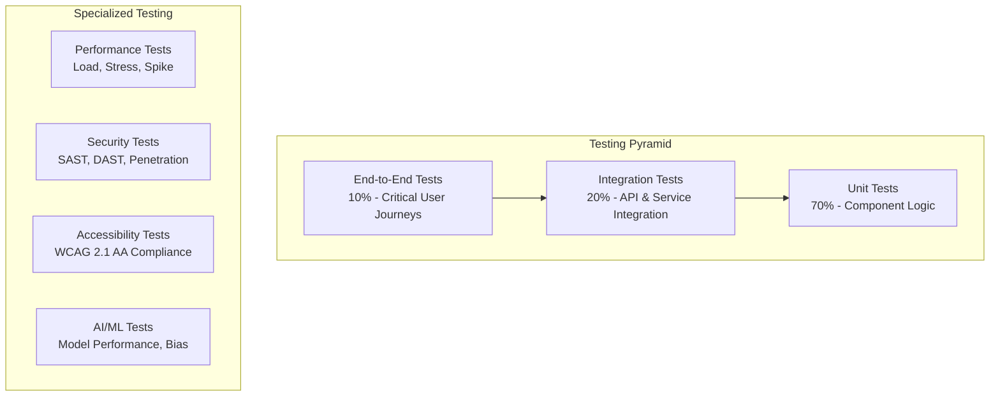

# NeuraForge QA Test Plan

## **Executive Summary**

This document outlines the comprehensive testing strategy for NeuraForge, ensuring quality delivery across all features with automated testing, performance validation, and security verification. The plan supports continuous integration and deployment while maintaining 99.9% uptime and zero critical bugs in production.

**Testing Objectives:**
- **Functional Quality**: All features work as specified
- **Performance**: Sub-1s load times, <50ms collaboration latency
- **Security**: Zero vulnerabilities in production
- **Reliability**: 99.9% uptime with graceful degradation

---

## **TESTING STRATEGY OVERVIEW**

### **Testing Pyramid**



### **Test Coverage Requirements**

| Test Type | Coverage Target | Tools | Frequency |
|-----------|----------------|-------|-----------|
| Unit Tests | 90%+ | Jest, Vitest | Every commit |
| Integration Tests | 80%+ | Supertest, Testcontainers | Every PR |
| E2E Tests | Critical paths | Playwright | Daily |
| Performance Tests | Key scenarios | k6, Artillery | Weekly |
| Security Tests | All endpoints | OWASP ZAP, Snyk | Daily |
| Accessibility Tests | All UI components | axe-core, Pa11y | Every PR |

---

## **UNIT TESTING**

### **Frontend Unit Tests (React/Next.js)**

**Component Testing Framework:**
```typescript
// Example: AI Assistant Component Test
import { render, screen, fireEvent, waitFor } from '@testing-library/react'
import { AIAssistant } from '@/components/ai/AIAssistant'
import { mockAIResponse } from '@/test/mocks/ai'

describe('AIAssistant Component', () => {
  beforeEach(() => {
    jest.clearAllMocks()
  })

  test('should render AI assistant interface', () => {
    render(<AIAssistant />)
    expect(screen.getByPlaceholderText('Ask your research question...')).toBeInTheDocument()
    expect(screen.getByRole('button', { name: 'Send' })).toBeInTheDocument()
  })

  test('should handle user query and display AI response', async () => {
    const mockQuery = 'What are the latest trends in AI research?'
    const mockResponse = mockAIResponse({
      message: 'Based on recent literature, key trends include...',
      confidence: 0.85,
      citations: ['paper1', 'paper2']
    })

    render(<AIAssistant />)
    
    const input = screen.getByPlaceholderText('Ask your research question...')
    const sendButton = screen.getByRole('button', { name: 'Send' })
    
    fireEvent.change(input, { target: { value: mockQuery } })
    fireEvent.click(sendButton)
    
    await waitFor(() => {
      expect(screen.getByText(/Based on recent literature/)).toBeInTheDocument()
      expect(screen.getByText('Confidence: 85%')).toBeInTheDocument()
    })
  })

  test('should handle AI service errors gracefully', async () => {
    // Mock AI service failure
    jest.spyOn(aiService, 'query').mockRejectedValue(new Error('Service unavailable'))
    
    render(<AIAssistant />)
    
    const input = screen.getByPlaceholderText('Ask your research question...')
    fireEvent.change(input, { target: { value: 'test query' } })
    fireEvent.click(screen.getByRole('button', { name: 'Send' }))
    
    await waitFor(() => {
      expect(screen.getByText(/Sorry, I'm having trouble/)).toBeInTheDocument()
    })
  })
})
```

### **Backend Unit Tests (Fastify/Node.js)**

**API Route Testing:**
```typescript
// Example: Project Management API Tests
import { build } from '../src/app'
import { FastifyInstance } from 'fastify'

describe('Project API Routes', () => {
  let app: FastifyInstance

  beforeAll(async () => {
    app = build({ logger: false })
    await app.ready()
  })

  afterAll(async () => {
    await app.close()
  })

  describe('POST /api/v1/projects', () => {
    test('should create new project with valid data', async () => {
      const projectData = {
        name: 'Test Research Project',
        description: 'A test project for unit testing',
        visibility: 'private'
      }

      const response = await app.inject({
        method: 'POST',
        url: '/api/v1/projects',
        headers: {
          authorization: 'Bearer valid-jwt-token'
        },
        payload: projectData
      })

      expect(response.statusCode).toBe(201)
      const project = JSON.parse(response.payload)
      expect(project.name).toBe(projectData.name)
      expect(project.id).toBeDefined()
      expect(project.created_at).toBeDefined()
    })

    test('should reject project creation with invalid data', async () => {
      const invalidData = {
        name: '', // Empty name should fail validation
        description: 'Test description'
      }

      const response = await app.inject({
        method: 'POST',
        url: '/api/v1/projects',
        headers: {
          authorization: 'Bearer valid-jwt-token'
        },
        payload: invalidData
      })

      expect(response.statusCode).toBe(400)
      const error = JSON.parse(response.payload)
      expect(error.error.code).toBe('VALIDATION_ERROR')
    })
  })
})
```

---

## **INTEGRATION TESTING**

### **API Integration Tests**

**Service Integration Testing:**
```typescript
// Example: AI Service Integration Test
import { testContainer } from '@/test/setup/testcontainers'
import { AIOrchestrationService } from '@/services/ai/orchestration'
import { DatabaseService } from '@/services/database'

describe('AI Service Integration', () => {
  let aiService: AIOrchestrationService
  let dbService: DatabaseService

  beforeAll(async () => {
    await testContainer.start()
    dbService = new DatabaseService(testContainer.getConnectionString())
    aiService = new AIOrchestrationService(dbService)
  })

  afterAll(async () => {
    await testContainer.stop()
  })

  test('should process literature review request end-to-end', async () => {
    // Create test user and project
    const user = await dbService.createUser({
      email: 'test@example.com',
      name: 'Test Researcher'
    })
    
    const project = await dbService.createProject({
      name: 'Test Project',
      owner_id: user.id
    })

    // Test AI literature review
    const query = 'machine learning in healthcare'
    const result = await aiService.generateLiteratureReview({
      query,
      user_id: user.id,
      project_id: project.id,
      max_papers: 10
    })

    expect(result.summary).toBeDefined()
    expect(result.papers).toHaveLength(10)
    expect(result.research_gaps).toBeInstanceOf(Array)
    expect(result.key_findings).toBeInstanceOf(Array)

    // Verify database persistence
    const savedReview = await dbService.getLiteratureReview(result.id)
    expect(savedReview.query).toBe(query)
    expect(savedReview.user_id).toBe(user.id)
  })
})
```

### **Database Integration Tests**

**Data Layer Testing:**
```typescript
// Example: Research Tree Integration Test
describe('Research Tree Data Operations', () => {
  test('should handle complex research tree operations', async () => {
    const project = await createTestProject()
    
    // Create initial research tree
    const tree = await researchTreeService.create({
      project_id: project.id,
      name: 'Main Research Path',
      structure: {
        nodes: [
          { id: 'root', type: 'hypothesis', content: 'Initial hypothesis' }
        ],
        edges: []
      }
    })

    // Create branch
    const branch = await researchTreeService.createBranch({
      tree_id: tree.id,
      from_node: 'root',
      hypothesis: 'Alternative approach'
    })

    // Add nodes to branch
    await researchTreeService.addNode(branch.id, {
      type: 'experiment',
      content: 'Experimental design',
      parent: 'root'
    })

    // Merge branch back
    const mergeResult = await researchTreeService.merge({
      source_branch: branch.id,
      target_branch: tree.id,
      merge_strategy: 'auto'
    })

    expect(mergeResult.conflicts).toHaveLength(0)
    expect(mergeResult.success).toBe(true)

    // Verify final tree structure
    const finalTree = await researchTreeService.get(tree.id)
    expect(finalTree.structure.nodes).toHaveLength(3) // root + 2 new nodes
  })
})
```

---

## **END-TO-END TESTING**

### **Critical User Journey Tests**

**Playwright E2E Tests:**
```typescript
// Example: Complete Research Workflow E2E Test
import { test, expect } from '@playwright/test'

test.describe('Complete Research Workflow', () => {
  test('researcher can complete full research project lifecycle', async ({ page }) => {
    // Login
    await page.goto('/login')
    await page.fill('[data-testid="email"]', 'researcher@university.edu')
    await page.fill('[data-testid="password"]', 'SecurePassword123!')
    await page.click('[data-testid="login-button"]')
    
    await expect(page).toHaveURL('/dashboard')

    // Create new project
    await page.click('[data-testid="new-project-button"]')
    await page.fill('[data-testid="project-name"]', 'AI Ethics Research')
    await page.fill('[data-testid="project-description"]', 'Investigating ethical implications of AI in healthcare')
    await page.selectOption('[data-testid="project-template"]', 'literature-review')
    await page.click('[data-testid="create-project"]')

    await expect(page.locator('[data-testid="project-title"]')).toContainText('AI Ethics Research')

    // Interact with AI assistant
    await page.click('[data-testid="ai-assistant-toggle"]')
    await page.fill('[data-testid="ai-query-input"]', 'What are the main ethical concerns with AI in healthcare?')
    await page.click('[data-testid="ai-send-button"]')

    // Wait for AI response
    await expect(page.locator('[data-testid="ai-response"]')).toBeVisible({ timeout: 10000 })
    await expect(page.locator('[data-testid="ai-response"]')).toContainText('ethical concerns')

    // Invite collaborator
    await page.click('[data-testid="invite-collaborator"]')
    await page.fill('[data-testid="collaborator-email"]', 'colleague@university.edu')
    await page.selectOption('[data-testid="collaborator-role"]', 'collaborator')
    await page.click('[data-testid="send-invitation"]')

    await expect(page.locator('[data-testid="success-message"]')).toContainText('Invitation sent')

    // Create research document
    await page.click('[data-testid="new-document"]')
    await page.fill('[data-testid="document-title"]', 'Literature Review Draft')
    
    // Test real-time collaboration
    await page.fill('[data-testid="document-editor"]', 'Introduction to AI Ethics in Healthcare...')
    
    // Verify auto-save
    await expect(page.locator('[data-testid="save-status"]')).toContainText('Saved')

    // Deploy AI agent
    await page.click('[data-testid="ai-agents-tab"]')
    await page.click('[data-testid="browse-agents"]')
    await page.click('[data-testid="deploy-agent-literature-analyzer"]')
    
    await expect(page.locator('[data-testid="agent-status"]')).toContainText('Active')

    // Generate research tree
    await page.click('[data-testid="research-tree-tab"]')
    await page.click('[data-testid="create-branch"]')
    await page.fill('[data-testid="branch-hypothesis"]', 'AI bias affects healthcare outcomes')
    await page.click('[data-testid="create-branch-confirm"]')

    await expect(page.locator('[data-testid="research-tree-visualization"]')).toBeVisible()
  })
})
```

### **Cross-Browser Testing**

**Browser Compatibility Matrix:**
| Feature | Chrome | Firefox | Safari | Edge |
|---------|--------|---------|--------|------|
| Authentication | ✓ | ✓ | ✓ | ✓ |
| Real-time Collaboration | ✓ | ✓ | ✓ | ✓ |
| AI Assistant | ✓ | ✓ | ✓ | ✓ |
| File Upload | ✓ | ✓ | ✓ | ✓ |
| WebSocket Connection | ✓ | ✓ | ✓ | ✓ |

---

## **PERFORMANCE TESTING**

### **Load Testing with k6**

```javascript
// Example: API Load Test
import http from 'k6/http'
import { check, sleep } from 'k6'

export let options = {
  stages: [
    { duration: '2m', target: 100 }, // Ramp up to 100 users
    { duration: '5m', target: 100 }, // Stay at 100 users
    { duration: '2m', target: 200 }, // Ramp up to 200 users
    { duration: '5m', target: 200 }, // Stay at 200 users
    { duration: '2m', target: 0 },   // Ramp down to 0 users
  ],
  thresholds: {
    http_req_duration: ['p(95)<500'], // 95% of requests under 500ms
    http_req_failed: ['rate<0.1'],    // Error rate under 10%
  },
}

export default function () {
  // Test project listing API
  let response = http.get('https://api.neuraforge.ai/v1/projects', {
    headers: {
      'Authorization': 'Bearer ' + __ENV.API_TOKEN,
    },
  })
  
  check(response, {
    'status is 200': (r) => r.status === 200,
    'response time < 500ms': (r) => r.timings.duration < 500,
    'has projects array': (r) => JSON.parse(r.body).projects !== undefined,
  })

  sleep(1)
}
```

### **AI Performance Testing**

```typescript
// Example: AI Response Time Test
describe('AI Performance Tests', () => {
  test('AI assistant should respond within 3 seconds', async () => {
    const startTime = Date.now()
    
    const response = await aiService.query({
      message: 'Summarize recent advances in quantum computing',
      context: { domain: 'computer_science' }
    })
    
    const responseTime = Date.now() - startTime
    
    expect(responseTime).toBeLessThan(3000) // 3 seconds
    expect(response.confidence).toBeGreaterThan(0.7)
    expect(response.citations).toHaveLength.greaterThan(0)
  })

  test('AI should handle concurrent requests efficiently', async () => {
    const concurrentRequests = 10
    const queries = Array(concurrentRequests).fill(0).map((_, i) => 
      aiService.query({ message: `Test query ${i}` })
    )
    
    const startTime = Date.now()
    const responses = await Promise.all(queries)
    const totalTime = Date.now() - startTime
    
    expect(totalTime).toBeLessThan(5000) // All requests within 5 seconds
    expect(responses).toHaveLength(concurrentRequests)
    responses.forEach(response => {
      expect(response.message).toBeDefined()
    })
  })
})
```

---

## **SECURITY TESTING**

### **Automated Security Scanning**

**SAST (Static Application Security Testing):**
```yaml
# GitHub Actions Security Workflow
name: Security Scan
on: [push, pull_request]

jobs:
  security:
    runs-on: ubuntu-latest
    steps:
      - uses: actions/checkout@v3
      
      - name: Run Snyk Security Scan
        uses: snyk/actions/node@master
        env:
          SNYK_TOKEN: ${{ secrets.SNYK_TOKEN }}
        with:
          args: --severity-threshold=high
      
      - name: Run CodeQL Analysis
        uses: github/codeql-action/analyze@v2
        with:
          languages: typescript, javascript
      
      - name: Run OWASP Dependency Check
        run: |
          dependency-check --project "NeuraForge" --scan . --format ALL
```

### **Penetration Testing Scenarios**

**Authentication Security Tests:**
```typescript
describe('Authentication Security', () => {
  test('should prevent brute force attacks', async () => {
    const invalidCredentials = {
      email: 'test@example.com',
      password: 'wrongpassword'
    }
    
    // Attempt multiple failed logins
    for (let i = 0; i < 6; i++) {
      await request(app)
        .post('/api/v1/auth/login')
        .send(invalidCredentials)
        .expect(401)
    }
    
    // Next attempt should be rate limited
    const response = await request(app)
      .post('/api/v1/auth/login')
      .send(invalidCredentials)
      .expect(429)
    
    expect(response.body.error.code).toBe('RATE_LIMITED')
  })

  test('should prevent SQL injection in login', async () => {
    const maliciousPayload = {
      email: "admin@example.com'; DROP TABLE users; --",
      password: 'password'
    }
    
    const response = await request(app)
      .post('/api/v1/auth/login')
      .send(maliciousPayload)
    
    expect(response.status).toBe(400)
    expect(response.body.error.code).toBe('VALIDATION_ERROR')
  })
})
```

---

## **ACCESSIBILITY TESTING**

### **Automated Accessibility Tests**

```typescript
// Example: Accessibility Test with axe-core
import { axe, toHaveNoViolations } from 'jest-axe'
import { render } from '@testing-library/react'

expect.extend(toHaveNoViolations)

describe('Accessibility Tests', () => {
  test('Dashboard should have no accessibility violations', async () => {
    const { container } = render(<Dashboard />)
    const results = await axe(container)
    expect(results).toHaveNoViolations()
  })

  test('AI Assistant should be keyboard navigable', async () => {
    const { container } = render(<AIAssistant />)
    
    // Test keyboard navigation
    const input = container.querySelector('[data-testid="ai-query-input"]')
    const sendButton = container.querySelector('[data-testid="ai-send-button"]')
    
    expect(input).toHaveAttribute('tabindex', '0')
    expect(sendButton).toHaveAttribute('tabindex', '0')
    
    // Test ARIA labels
    expect(input).toHaveAttribute('aria-label')
    expect(sendButton).toHaveAttribute('aria-label')
  })
})
```

---

## **TEST AUTOMATION PIPELINE**

### **CI/CD Integration**

```yaml
# Example: GitHub Actions Test Pipeline
name: Test Pipeline
on: [push, pull_request]

jobs:
  unit-tests:
    runs-on: ubuntu-latest
    steps:
      - uses: actions/checkout@v3
      - uses: actions/setup-node@v3
        with:
          node-version: '18'
      - run: npm ci
      - run: npm run test:unit
      - run: npm run test:coverage
      
  integration-tests:
    runs-on: ubuntu-latest
    services:
      postgres:
        image: postgres:15
        env:
          POSTGRES_PASSWORD: postgres
        options: >-
          --health-cmd pg_isready
          --health-interval 10s
          --health-timeout 5s
          --health-retries 5
    steps:
      - uses: actions/checkout@v3
      - run: npm ci
      - run: npm run test:integration
      
  e2e-tests:
    runs-on: ubuntu-latest
    steps:
      - uses: actions/checkout@v3
      - uses: actions/setup-node@v3
      - run: npm ci
      - run: npx playwright install
      - run: npm run test:e2e
      
  performance-tests:
    runs-on: ubuntu-latest
    if: github.ref == 'refs/heads/main'
    steps:
      - uses: actions/checkout@v3
      - run: npm ci
      - run: npm run test:performance
```

### **Test Reporting**

**Quality Gates:**
- Unit test coverage: >90%
- Integration test coverage: >80%
- E2E test pass rate: 100%
- Performance benchmarks: All pass
- Security scan: No high/critical issues
- Accessibility: WCAG 2.1 AA compliant

This comprehensive test plan ensures NeuraForge maintains the highest quality standards while supporting rapid development and deployment cycles.
